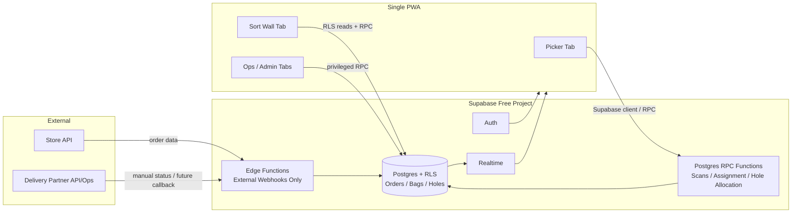
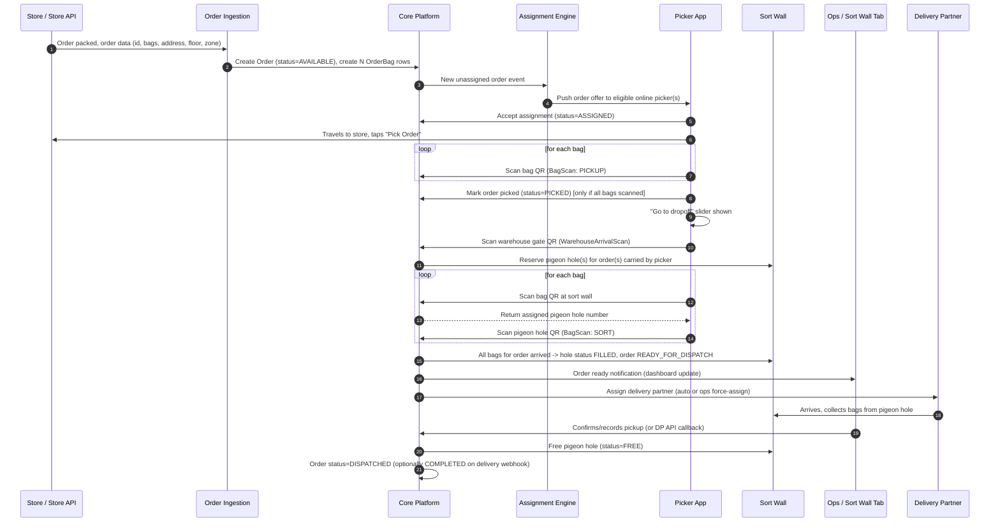
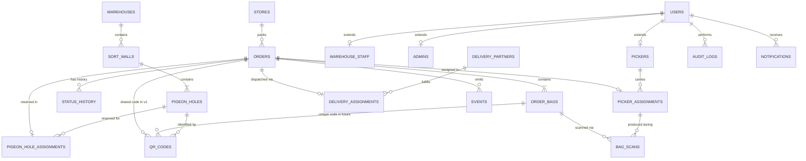
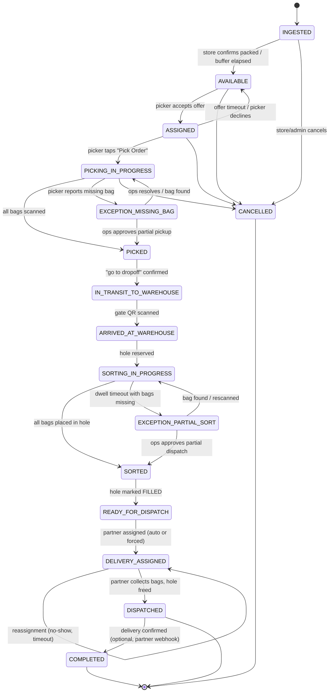
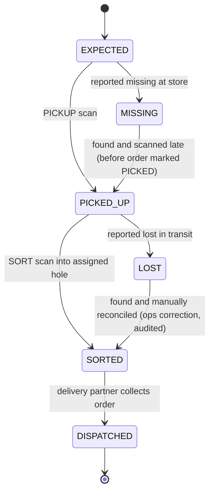
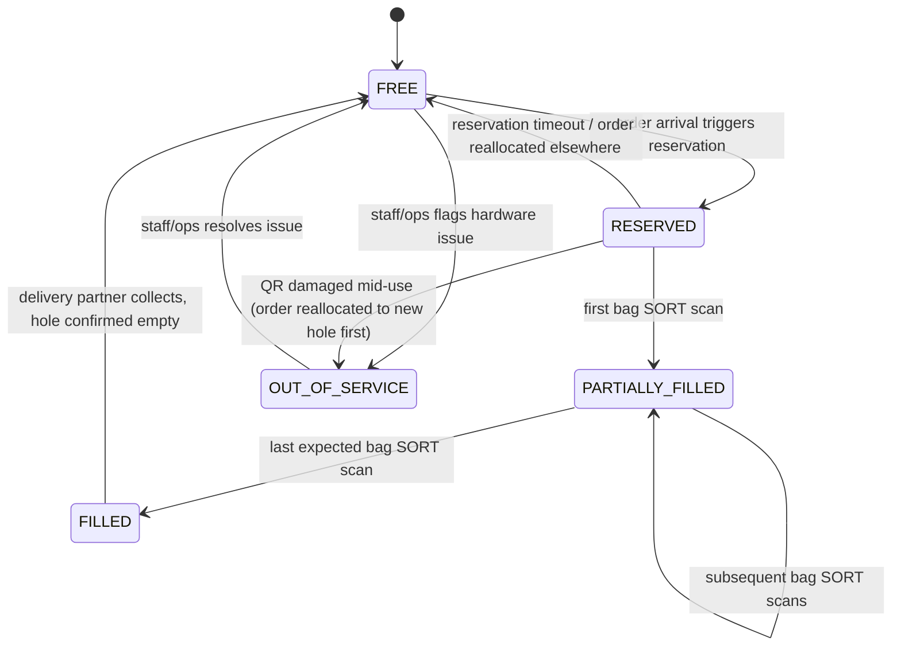
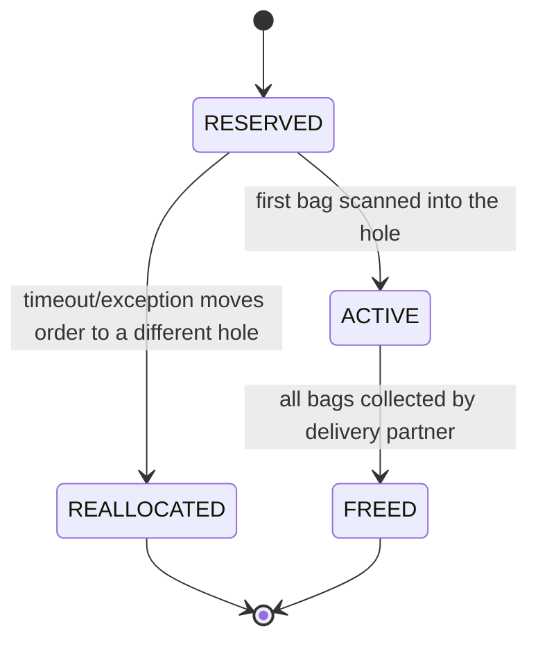
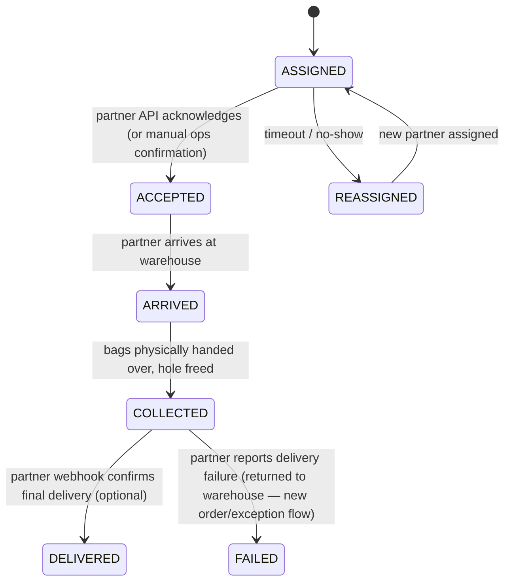
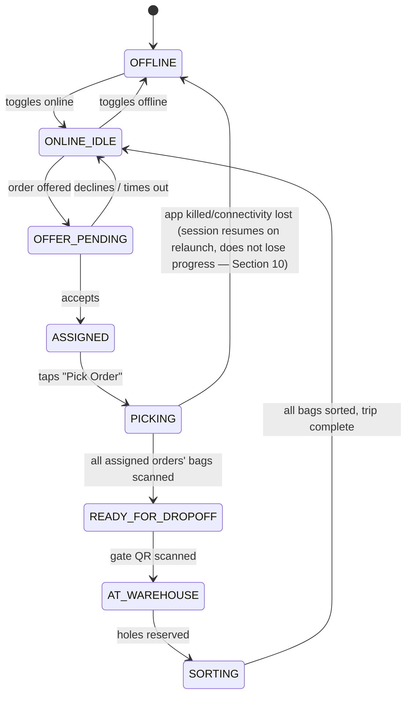

# Technical Design Document
## First & Middle-Mile Logistics Platform (Store → Picker → Warehouse Sort Wall → Delivery Partner)

**Status:** Draft for CTO review
**Audience:** Engineering leadership, founding engineers, operations leadership
**Author role:** Principal Engineer (architecture) / PM (operational workflow)
**Companion input:** Product Requirements Document — "Picker App / Sort Wall Website" (attached)

---

## How to read this document

This document is intentionally long because the system, while operationally simple on the surface, sits at the intersection of four hard problems simultaneously: **physical-world verification** (did the right bag actually move to the right place), **distributed mobile connectivity** (pickers work in stores and warehouses with poor Wi-Fi/cellular), **human process compliance** (25 warehouse staff, 50 pickers, high turnover, low technical literacy), and **real-time coordination** (sort wall capacity is physically finite and must never deadlock).

Each section below is written to stand on its own, but Section 1 (System Overview) and Section 3 (Complete Workflow) should be read first because every later section — database, APIs, state machines — is a direct derivative of the workflow, not the other way around. This is intentional: **we design the operational workflow first, and let the schema/API fall out of it**, rather than starting from tables and hoping the workflow fits.

Throughout the document, callout boxes marked **⚠️ PRD Challenge** flag a place where the attached PRD's stated approach would very likely fail, degrade, or create unacceptable operational/fraud risk once real staff and real volume hit the system. Each challenge includes a recommended alternative and — critically — a note on whether it is safe to defer or must be fixed before any pilot.

---

## Table of Contents

1. System Overview
2. Actors
3. Complete Workflow
4. Screen-by-Screen Product Specification
5. Database Design
6. State Machines
7. API Design
8. Event Flow
9. QR Code Strategy
10. Offline Support
11. Authentication
12. Admin Panel
13. Sort Wall Logic
14. Notifications
15. Logging
16. Monitoring
17. Security
18. Scalability Roadmap
19. Technology Recommendations
20. Fastest MVP
21. Technical Risks
22. Future Improvements
Appendix A — Glossary
Appendix B — Summary of PRD Challenges

---

# 1. System Overview

## 1.1 What this system actually is

Strip away the app screens and this is a **chain-of-custody tracking system for physical bags**, wrapped around a **capacity-constrained physical buffer** (the sort wall), feeding a **hand-off to a third party** (the delivery partner). It has more in common with a warehouse management system (WMS) / cross-dock operation than with a typical CRUD SaaS product. That framing matters because it changes what "correct" means:

- In a normal SaaS app, if the UI shows the wrong thing for a few seconds, it's a bug. Here, if the system shows "bag arrived" when it didn't, **a real bag gets physically lost**, an order never gets delivered, and a warehouse employee gets blamed for something the software let happen.
- Every screen and API in this system is really a **witness statement**: "I, this specific device, at this specific time, scanned this specific code." With shared order-level bag codes in v1, that statement proves an order-code scan action and declared count progression, not the identity of an individual physical bag. This is why the design emphasizes idempotency, honest evidence semantics, audit trails, and a forward-compatible QR model rather than UI polish.

## 1.2 High-level explanation

The platform moves a bag from a store's shelf to a delivery partner's hands via one intermediate stop (the warehouse sort wall). The MVP has only two deployable systems:

1. **One role-aware Progressive Web App (PWA)** — the same URL and codebase opens in Chrome and can optionally be installed to the home screen. Picker, Sort Wall, Ops, and Admin are tabs/routes in this PWA. Authentication and server-enforced permissions determine which tabs and data each user can access. Pickers use the Picker tab for assignments/scanning; warehouse roles use the Sort Wall tab for live wall operations.
2. **Supabase backend** — hosted Postgres, Auth, Row Level Security (RLS), Realtime, Storage, database functions for transactional workflows, and Edge Functions only where a trusted server boundary is required (Store API webhooks or secrets).



## 1.3 System goals

**Primary goals (must be true from day one):**

- **Non-negotiable order-level chain-of-custody integrity.** At any moment, for any order, we can answer the last recorded location, actor, and bag-count progress with scan evidence. In shared-QR v1, we cannot answer which individual physical bag was touched or distinguish repeated scans of one label from scans of different bags; the system must expose that limitation rather than infer certainty it does not have.
- **Operate correctly with unreliable connectivity.** Pickers work inside stores and warehouses where Wi-Fi/cellular is often poor. The app must let a picker keep working — scanning bags — even with zero connectivity, and reconcile safely once back online.
- **Never physically deadlock the sort wall.** Because pigeon holes are a finite physical resource, the software must guarantee there's always an escape valve (force-assign, overflow handling) so operations never have a bag with nowhere to go.
- **Fast iteration at low volume, no rewrite at 100x volume.** At 100 orders/day, the team should be able to ship features in days, not weeks. At 10,000+ orders/day, the same conceptual model (not necessarily the same infrastructure) should still apply — see Section 18.
- **Every state transition is auditable and reversible by a human.** Ops must always be able to see why an order is in a given state and manually override it, with a permanent audit trail of who did what.

**Secondary goals:**

- Minimize picker training time (warehouse staff turnover is high in this industry; screens must be foolproof).
- Minimize the number of distinct technologies the (currently very small) engineering team must operate.
- Keep infrastructure cost proportional to order volume, not fixed overhead that punishes an early-stage startup.

## 1.4 Non-goals (explicitly out of scope for this design)

- **Last-mile delivery tracking and management.** The delivery partner owns everything from "bag collected from pigeon hole" onward. We optionally *receive* status webhooks from them (delivered/failed), but we do not build route optimization, courier apps, or live customer-facing delivery tracking maps. That is a different product.
- **Customer-facing app or notifications.** The PRD does not mention an end-customer app; this design assumes the *store* owns the customer relationship and customer notifications. We only notify our own actors (pickers, warehouse staff, ops, delivery partners).
- **Inventory management inside the store.** We consume the store's packed order data; we do not manage the store's stock, packing correctness, or SKU-level contents. A "bag" to us is an opaque, sealed unit identified by a QR code — we have no visibility into what's inside it (this has QR-integrity consequences discussed in Section 9).
- **Billing / invoicing / payments to pickers, stores, or delivery partners.** Financial settlement is assumed to be a separate system (or manual, at this scale) that consumes our event log as its source of truth, but is not part of this platform.
- **Route optimization for pickers across multiple stores.** At current scale (≤50 pickers, 100 orders/day) we assume one picker mostly serves one store visit per trip or a small manually/simply batched set; multi-stop route optimization is a Section 22 future improvement, not a v1 requirement.

## 1.5 Assumptions

These are assumptions this design makes explicit because the PRD leaves them implicit. Several are challenged later in this document.

1. Each **Store** exposes (or will expose) an API that the platform can either poll or receive webhooks from, containing: order ID, number of shipments, number of bags, store address, floor, zone. We assume this API is **eventually consistent and occasionally unavailable** — it is a third party's system, not ours, and must be treated with the same defensive posture as any external dependency (timeouts, retries, circusuit breakers).
2. A **bag** is the atomic physical unit that gets scanned, carried, and sorted. An **order** is a logical grouping of 1..N bags that must all travel together and land in the same pigeon hole.
3. **One warehouse, one sort wall** is the initial physical topology (consistent with "less than 25 warehouse staff"), but the schema is designed so multi-warehouse, multi-sort-wall is additive, not a rewrite (Section 5, Section 18).
4. Every human actor uses the same HTTPS PWA. Pickers open it in Chrome/mobile browser or install it to the home screen; warehouse/ops staff open the same URL on desktop/tablet. Camera scanning requires browser camera permission and HTTPS.
5. Delivery partner integration starts as **manual, ops-driven assignment** (an ops person picks a partner from a list) and evolves toward automatic API-driven assignment as partner integrations mature — see Section 1.6 and Section 13.
6. Network connectivity is available *intermittently* everywhere pickers operate, but must never be *assumed* available at the moment a scan happens.

## 1.6 Constraints

- **Team size and velocity.** This is an early-stage startup. The architecture must be operable by a small team (likely 2–5 engineers) without a dedicated platform/SRE function. Every infrastructure choice in Section 19 is evaluated against "can 2 engineers keep this alive at 2am."
- **Physical hardware constraints.** Pigeon holes are a fixed, physical, expensive-to-change resource. Software must treat sort wall capacity as a hard constraint, not something that can be "scaled" the way cloud compute can.
- **Human factors.** Warehouse staff and pickers are not the target audience for a beautifully complex app — screens must be reduced to single, obvious actions with large tap targets and minimal text, because misuse under time pressure is the single largest source of real-world data corruption in this class of system (this is a very well-documented failure mode in WMS/logistics software — see Section 21).
- **Budget.** MVP recurring infrastructure spend is constrained to **$0**. The design uses Supabase Free plus free static PWA hosting and avoids SMS, WhatsApp, paid observability, paid maps, and a separate backend host. Free-tier quotas and inactivity policies are external constraints that must be monitored; exceeding them is a business trigger to fund the first paid tier, not a reason to compromise data integrity.

---

# 2. Actors

Each actor is described by: who they are, what device/interface they use, what they can do, and what happens if they misbehave or are unavailable (since operational resilience depends on designing for absence/failure of every actor, not just their happy path).

### 2.1 Picker

- **Who:** A gig or contracted worker who physically travels to stores, collects bags, and delivers them to the warehouse sort wall. Up to 50 concurrently in the initial deployment.
- **Interface:** Picker tab in the shared PWA, opened in Chrome/mobile browser or optionally installed. Uses browser camera and geolocation APIs.
- **Capabilities:** Toggle online/offline, receive order assignments, scan bags at store, mark order picked, travel to warehouse, scan warehouse gate QR, scan bags into pigeon holes.
- **Failure modes to design for:** Picker goes offline mid-trip (phone dies, app crashes, tunnel/basement connectivity); picker scans the wrong bag; picker never completes a pickup (abandons the app); picker's GPS is spoofed or disabled; picker double-scans the same bag; picker is a bad actor trying to fraud (mark done without actually collecting).

### 2.2 Warehouse Staff

- **Who:** On-site employees at the warehouse who physically manage the sort wall — placing/removing bags, doing manual corrections, assisting delivery partners. Up to 25 in initial deployment.
- **Interface:** Sort Wall tab in the same PWA, normally on a shared warehouse tablet/desktop; visibility and actions are role-controlled.
- **Capabilities:** View live pigeon hole occupancy, manually mark a bag as arrived/missing (exception handling), assist delivery partner pickup, flag a pigeon hole out-of-service.
- **Failure modes:** Staff misreads a hole number; staff performs a correction without understanding downstream effects; shift handover loses context on an in-progress exception.

### 2.3 Sort Wall (physical + logical system)

- **What:** Not a human actor, but a first-class system entity: a numbered grid of pigeon holes, each with a QR code, each capable of holding exactly one order's bags at a time. This document separates the **physical Sort Wall** (Section 13) from the **Sort Wall tab** in the shared PWA.
- **Behavior:** Purely reactive — it does not "act," but its state (free/reserved/filled/blocked) drives almost every downstream decision (assignment, dispatch, exceptions).

### 2.4 Operations Manager

- **Who:** Supervises multiple warehouse staff and pickers; the "break glass" actor for the whole system. Likely 1–3 people initially, could be one person wearing multiple hats at 100 orders/day.
- **Interface:** Sort Wall, Exceptions, and Ops/Admin tabs in the shared PWA, exposed by role.
- **Capabilities:** Everything Warehouse Staff can do, plus: force-assign delivery partners, reassign pickers, view cross-warehouse dashboards, view audit logs, manage users, override any state transition with a logged reason.
- **Failure modes:** Single point of accountability — if this role doesn't exist or isn't staffed 24/7, exceptions pile up unresolved (Section 21 risk).

### 2.5 Delivery Partner

- **Who:** The last-mile courier/company that collects completed orders from the sort wall and delivers to the end customer. Could be a single in-house fleet, or one/many third-party delivery aggregators (e.g., a Dunzo/Porter/Shadowfax-style API, or a manual walk-in courier).
- **Interface:** Depends on maturity — Phase 1: no interface at all, an ops person calls/messages them and hands them a printed/verbal pigeon hole number. Phase 2: a partner API that receives assignment webhooks and sends back status updates. Phase 3: a lightweight partner portal/app.
- **Capabilities (logical, regardless of interface maturity):** Accept/reject an assignment, arrive at warehouse, collect an order from its pigeon hole, mark delivered/failed.
- **Failure modes:** Partner never comes to collect (order sits in a pigeon hole indefinitely — this is the #1 sort-wall-capacity risk, addressed heavily in Section 13); partner collects the wrong order; partner has no reliable API (very likely at small scale) forcing manual-only workflows.

### 2.6 Store

- **Who:** The merchant whose staff physically pack the order into bags before our picker arrives. Not a technical actor — they interact with us only through the packing process and (indirectly) their own order/POS system.
- **Interface:** None directly with our platform (v1). They interact with their own systems; we consume the **Store API** on their behalf.
- **Failure modes:** Store packs the wrong number of bags vs. what their API reported; store staff is unaware a picker is en route; store's QR-printing process (if they print bag QR codes) fails or prints duplicate/garbled codes.

### 2.7 Store API (external system)

- **What:** The third-party integration point (per store, or per store-chain) that tells our platform an order exists and its metadata (order ID, shipment count, bag count, address, floor, zone).
- **Behavior:** Could be push (webhook to us) or pull (we poll their endpoint) depending on the store's technical maturity — **this is explicitly NOT specified in the PRD and must be resolved per-integration** (see Section 1.6 and the PRD Challenge in Section 3.1).
- **Failure modes:** Downtime, rate limiting, schema drift (they change a field without notice), duplicate delivery of the same order (must be idempotent on our side), late/incorrect bag counts.

### 2.8 Admin

- **Who:** Platform administrators — typically founding engineers or a designated platform owner in the early stage, evolving into a dedicated internal-tools/ops-tech role at scale.
- **Interface:** Admin tabs in the shared PWA (Section 12), plus the Supabase Dashboard for bootstrap-only identity/platform operations.
- **Capabilities:** Superset of Operations Manager — manage warehouses, sort walls, pigeon hole layout, users and roles, store integrations/API keys, QR code lifecycle, global configuration.

### 2.9 External Systems (summary)

| System | Direction | Purpose |
|---|---|---|
| Store API | Inbound | Order & bag metadata |
| Delivery Partner / Ops | Manual in MVP; future API | Ops contacts partner manually and records status |
| Supabase | Bidirectional | Database, Auth, RPC, Realtime, optional Storage/Edge Functions |
| Cloudflare Pages | Outbound deployment | Static PWA hosting |
| Paid push/SMS/WhatsApp providers | Future only | Explicitly absent from $0 MVP |

---

# 3. Complete Workflow

## 3.1 End-to-end sequence



> **⚠️ PRD Challenge — "Order Available" is treated as a single instantaneous event, but it is actually two decisions bundled together.** The PRD states we "get the order details... from their API" and then the picker sees it. In practice there are two distinct questions that must not be conflated: (1) *does the order exist in our system* (ingestion) and (2) *is it physically ready to be picked up* (the store has actually finished packing). If the Store API reports an order the instant it's created — before packing finishes — pickers will be offered orders that aren't ready, driving wasted trips and picker distrust of the app (a fast way to lose gig workers). **Recommendation:** model two explicit states, `INGESTED` (we know about it) and `AVAILABLE` (store confirms packed / API explicitly signals ready), and only surface `AVAILABLE` orders to the Assignment Engine. If a given store's API cannot distinguish these (many won't, especially early integrations), default to a conservative buffer (e.g., don't offer for assignment until N minutes after ingestion, configurable per store) until a true "packed" signal exists. This is cheap to build now and expensive to retrofit once pickers have learned to distrust the app.

## 3.2 Stage 1 — Order Ingestion

1. Store packs the order.
2. Store's system calls (or is polled by) the platform's **Order Ingestion Service**, providing: external order ID, store ID, number of shipments, number of bags, store address, floor, zone, and (if available) a packed/ready timestamp.
3. Platform validates payload, deduplicates by `(store_id, external_order_id)` (idempotency — the same order must never be double-ingested even if the Store API retries or double-fires a webhook), and creates:
   - One `orders` row (status `INGESTED` → `AVAILABLE`)
   - N `order_bags` rows (one per bag, count from the Store API)
   - N QR code registrations (see Section 9 for numbering strategy — this is where the single-biggest PRD gap is fixed)
4. Order becomes visible to the Assignment Engine once in `AVAILABLE` state.

**Edge cases:**
- **Duplicate order push:** Store API retries the same webhook. → Idempotency key `(store_id, external_order_id)` with a unique DB constraint; second call is a no-op that returns the existing order (HTTP 200, not 201).
- **Bag count later corrected by store** (e.g., store realizes it's 4 bags not 5, before pickup): Store API sends an update. → Only allowed while order is in `AVAILABLE` or `ASSIGNED` and no bags have been scanned yet; once the first bag scan occurs, the bag count is **locked** and any further "correction" must go through an Ops exception flow, not a silent API update (prevents a store's late correction from silently invalidating a picker's in-progress physical count).
- **Store API unreachable / times out:** Retry with exponential backoff (webhook receiver returns 5xx to trigger store's own retry, if push-based; if poll-based, retry on our own schedule). If order data is essential and unavailable beyond a threshold, escalate to Ops as an "orphan order" alert rather than silently dropping it.
- **Malformed payload (missing address, zero bags, negative bags):** Reject at the API boundary with a clear validation error; never create a half-valid order. Log and alert — this indicates an integration bug on the store's side that needs a human conversation, not silent data corruption on ours.
- **Order cancelled by store after ingestion but before pickup:** Store API (or Admin manually) triggers cancellation; order moves to `CANCELLED` state; if already `ASSIGNED`, notify the picker to abort.

## 3.3 Stage 2 — Picker Assignment

> **⚠️ PRD Challenge — the PRD does not define an assignment algorithm at all**, only "if online they receive orders." At 50 pickers and 100 orders/day this is survivable with a naive broadcast-and-first-accept model, but it will actively work against you at 1,000+ orders/day because it has no concept of picker proximity, capacity, or fairness, and it does nothing to prevent double-assignment races.

Recommended v1 algorithm (deliberately simple, upgradeable — see Section 18):

1. When an order becomes `AVAILABLE`, the Assignment Engine finds eligible **online** pickers, filtered by store zone (if the picker app records a "home zone" or last-known GPS near the store).
2. Offer the order to the single best-ranked picker (rank = proximity, then current load) through an in-app Realtime update with a short accept window while the PWA is open. In the fastest MVP, Ops can manually assign instead, avoiding any dependency on off-app push.
3. If not accepted in time, or explicitly declined, offer to the next-ranked picker. After N rounds with no acceptance, escalate to Ops dashboard as "unassigned — needs manual dispatch."
4. A picker may be assigned multiple orders in one trip (batching), up to a configurable max (e.g., 3), if those orders are from the same store or nearby stores — this matches the PRD's Stage 2 wording "all the orders assigned to them," implying multi-order carrying is expected.

**Edge cases:**
- **Two pickers accept the same offer in a race condition:** Use a DB-level optimistic lock (`orders.assigned_picker_id` update with `WHERE assigned_picker_id IS NULL`, i.e., a conditional UPDATE) so only one accept can win; the loser gets a "already assigned" response and the order disappears from their queue immediately.
- **Assigned picker goes offline / doesn't move for X minutes:** Auto-timeout, order returns to `AVAILABLE`, picker is flagged for review (repeated timeouts affect future ranking).
- **No pickers online:** Order sits in `AVAILABLE`, surfaced prominently on the Ops dashboard with age-based escalation (color changes / alert after N minutes).
- **Picker manually rejects:** Immediately re-offered to next-ranked picker; rejection reasons optionally logged for pattern detection (e.g., a store consistently rejected — packing/location problem).

## 3.4 Stage 3 — Bag Scanning at Store (Picking)

1. Picker travels to the store (address/floor/zone shown in-app).
2. Picker taps "Pick Order," which starts the picking session for that order.
3. Picker scans each bag's QR code, one at a time. Each successful scan is recorded (`bag_scans` with type `PICKUP`) and the in-app checklist updates (bag N of M collected).
4. Once all M bags for the order are scanned, "Mark as Done" becomes enabled; tapping it transitions the order to `PICKED`.

> **Accepted MVP constraint — all bags in an order use the same order-level QR code.** The system will support this explicitly in v1. A picker scans the same order code once for each physical bag, and each accepted scan advances a counter (`K of M`) by assigning the event to the next logical bag slot. This verifies that the picker performed M scan actions against the correct order code; it **does not prove that M distinct physical bags were scanned**. One physical bag can be scanned repeatedly and is indistinguishable from M distinct bags at the software level. This limitation must be reflected honestly in operating procedures, audit language, and customer promises.
>
> **Compensating controls for v1:** enforce the Store API's expected bag count as a hard maximum; require a deliberate scan cadence (dismiss the success state and reposition the QR in the camera frame before the next scan) to reduce accidental rapid duplicates; display large numbered progress ("Bag 2 of 5 recorded"); capture timestamp, device, picker, and optional photo/GPS evidence for every scan; require the store representative or picker to confirm the final physical count before "Done"; and monitor implausibly fast repeated scans for review. These controls reduce accidental misuse but do not establish distinct bag identity. Per-bag unique QR codes remain a planned improvement, and the schema/API must support that migration without rewriting historical v1 records (Section 9).

**Edge cases (bag scanning):**
- **Repeated scan of the shared order QR:** Accept until the expected count M is reached, assigning each event to the next logical bag slot. Reject scan M+1 with `409 EXPECTED_BAG_COUNT_REACHED`. The system cannot determine whether scans 1..M came from different physical bags; the UX and audit record must not claim otherwise.
- **Scan a bag belonging to a different, unrelated order:** Reject; show "This bag belongs to a different order" and do not count it. Prevents cross-order contamination during multi-order picking.
- **Scan a QR that doesn't exist / is malformed / camera misreads:** Show a scan error with retry, never silently ignore (a silent no-op is indistinguishable from "app is frozen" to the picker).
- **Picker can't find/scan a bag (missing from shelf):** Provide an explicit "Report missing bag" action rather than forcing the picker to abandon the whole order; this creates an `EXCEPTION` sub-state on that specific bag and notifies Ops, while the picker can still complete the rest and optionally proceed with a partial order (configurable business policy — see Section 6 Bag state machine).
- **Store packs the wrong number of bags vs. Store API count:** Picker sees "expected 5, but store only has 4 ready" — same "Report" flow as missing bag; do not allow scanning past the reported count without an explicit override reason.
- **Order cancelled mid-pick:** Push a cancellation to the picker's in-progress session; picker is instructed to return bags to store; order moves to `CANCELLED`, any already-scanned bag events remain in the audit log (never deleted) but the order does not proceed further.

## 3.5 Stage 4 — Travel to Warehouse & Arrival Verification

1. After marking all assigned orders picked, picker is shown "Go to dropoff" (a slider/confirmation, matching the PRD screen).
2. On arrival at the warehouse, picker scans a **warehouse gate QR code** to prove physical arrival before being allowed into the sorting flow.

> **⚠️ PRD Challenge — a single static warehouse QR code is weak proof of arrival.** A photo of that QR code, once obtained by any picker, can be shared or reused indefinitely by anyone, defeating its stated purpose ("to verify that they have physically arrived at the location"). **Recommendation (tiered by effort):** *Minimum (ship now, near-zero cost):* record device GPS coordinates at the moment of the scan and store them alongside the scan event; flag (don't necessarily block) scans whose GPS is implausibly far from the warehouse for Ops review. *Better (cheap, ship soon):* rotate the warehouse gate QR code on a schedule (e.g., every few hours) via a small display/printed sheet refreshed by warehouse staff, so a stale screenshot stops working. *Best (Section 9/18):* short-lived signed QR tokens generated server-side and displayed on a screen at the gate. None of these require new hardware beyond what's already assumed (a picker's phone camera + a printed/displayed sign at the warehouse).

**Edge cases:**
- **Picker scans warehouse gate but has no picked orders (scanned by mistake / curiosity):** No-op with a friendly message; does not create sort-wall reservations.
- **Picker arrives with orders picked at different times (multi-stop trip):** All currently-`PICKED` orders assigned to that picker are included in the warehouse arrival batch; pigeon holes are reserved for all of them at once (Section 13).
- **GPS says picker is nowhere near warehouse:** Logged as a soft flag for Ops review; does not block the flow in v1 (avoid false blocking of legitimate operations due to poor GPS accuracy indoors), but is a canary metric — a picker with repeated GPS anomalies is a fraud/investigation signal (Section 16, Section 21).

## 3.6 Stage 5 — Sorting into Pigeon Holes

1. Picker scans a bag's QR code. The app looks up which pigeon hole that bag's order is assigned to (reserved in Stage 4) and displays it ("Go to hole P-42").
2. Picker physically walks to hole P-42, taps "Scan pigeon hole," and scans the pigeon hole's QR code.
3. This scan is recorded (`bag_scans` type `SORT`) and matched against the reservation; a mismatch (scanned a different hole than assigned) is rejected with a clear error.
4. Repeat for every bag the picker is carrying, across however many orders.
5. Once all bags for a given order have a `SORT` scan into its assigned hole, that order transitions to `SORTED` → `READY_FOR_DISPATCH`, and the hole's occupancy is marked full for that order.

**Edge cases:**
- **Picker scans a bag whose order has no pigeon hole reserved yet** (e.g., hole allocation failed because the wall was full at arrival time — see Section 13 overflow handling): App shows "Waiting for hole assignment" and the bag is placed in a designated overflow/staging area; the picker is notified in-app once a hole frees up and reallocation happens automatically, without requiring the picker to re-scan the bag from scratch (idempotent — the original scan event stays valid).
- **Picker scans the correct bag but the wrong pigeon hole:** Rejected before the physical placement is "confirmed" in the UI; picker is redirected to the correct hole number. (This assumes the app instructs scan-hole-QR *before* dropping the bag physically, which is exactly what the PRD screens show — bag scan reveals hole number, then hole QR scan confirms.)
- **Pigeon hole QR is damaged/unreadable:** "Report hole issue" action → Warehouse Staff/Ops receive an exception; hole is marked `OUT_OF_SERVICE`; order's remaining bags get reallocated to a different free hole (Section 13).
- **Two bags of the same order scanned into two different holes by mistake (shouldn't be possible if the app enforces the reservation, but must be defended against server-side too):** Server rejects a `SORT` scan whose hole doesn't match the order's active reservation, regardless of what the client believes — **never trust the client for a state transition this important.**
- **Partial arrival — order has 5 bags, only 3 ever arrive (1 lost at store, 1 lost in transit):** Hole stays `PARTIALLY_FILLED` indefinitely unless a timeout/exception policy kicks in. Ops dashboard surfaces "stuck orders" (in `PARTIALLY_FILLED` beyond a threshold, e.g., 2 hours) for manual resolution: mark bag `LOST`, and either proceed with partial dispatch (business decision, configurable) or hold for investigation.

## 3.7 Stage 6 — Delivery Partner Assignment & Dispatch

1. Once an order is `READY_FOR_DISPATCH`, the platform attempts automatic delivery partner assignment if an integrated partner API exists and has capacity; otherwise it surfaces the order in the Sort Wall Website's "ready" queue for manual assignment by Ops.
2. Ops (or the automated flow) assigns a delivery partner; the partner is given the pigeon hole number.
3. Delivery partner arrives, collects the bags, and the hole is freed — either via partner API callback, or Warehouse Staff manually confirming pickup in the Sort Wall Website.
4. Order transitions to `DISPATCHED`. If the platform later receives a delivery confirmation (from the partner, if they support it), order transitions to `COMPLETED`; otherwise `DISPATCHED` is a terminal state for our system's purposes.

**Edge cases:**
- **Order sits `READY_FOR_DISPATCH` too long (delivery partner delayed) while its hole is needed for other incoming orders:** This is exactly the PRD's stated "force assign delivery partner options in case an order is being delayed" — see Section 13 for the full overflow/priority design. The short version: Ops can force-assign a different/backup partner, or — if truly no partner is available — manually relocate the bags to a physical overflow shelf and free the hole in software while keeping the order in a `HELD_FOR_PICKUP` sub-state, so the wall's *software* capacity isn't blocked by a *physical* delay.
- **Delivery partner collects the wrong order from an adjacent hole:** Requires the hole-confirmation step (partner or staff scans/confirms the hole number, not just "which order") to catch mismatches before the hole is freed and reused.
- **Delivery partner never shows up at all (no-show):** Timeout → automatic re-assignment to a backup partner + Ops alert; this must have a default backup or manual fallback configured per warehouse, because an unassigned `READY_FOR_DISPATCH` order is the highest-severity stuck state in the entire system (a fully sorted order that never leaves is 100% wasted picker+warehouse labor).
- **Order cancelled after sorting but before dispatch (rare, but must be handled):** Ops override moves the order to `CANCELLED`, hole is freed, bags physically returned to store or disposed per business policy (out of software scope beyond recording the decision).

## 3.8 Cross-cutting workflow concerns

- **Idempotency everywhere a physical action is recorded.** Every scan (`bag_scans`) carries a client-generated UUID (`client_event_id`). If the same scan is submitted twice (e.g., due to a retried offline-sync request), the server recognizes the duplicate `client_event_id` and returns the original result rather than creating a second event or double-counting. This is what makes offline support (Section 10) safe.
- **Every state transition has a human-readable reason and actor.** Automated transitions record `actor_type = SYSTEM`; manual overrides always require a `reason` field, visible in the audit log (Section 5 `status_history`, Section 15).
- **No transition is silently "stuck" without visibility.** Every state has a maximum expected dwell time; exceeding it surfaces the order on an Ops "Exceptions" view (Section 12) — this single feature is likely the highest-leverage piece of the entire system for day-to-day operations, more so than any individual screen.

---

# 4. Screen-by-Screen Product Specification

This section documents every screen implied by the attached PRD mockups. These are not separate applications: Picker, Sort Wall, Ops, and Admin are role-gated tabs/routes in one responsive PWA. A Picker login lands on and can access only the Picker experience; warehouse/ops logins land on the Sort Wall experience; Admin tabs appear only for permitted roles.

## 4.0 Shared PWA Shell and Login

**Purpose:** Provide one URL, login flow, installation surface, navigation shell, and offline indicator for every role.

**Displayed information:** Product identity; email/password login form; post-login tab bar/sidebar assembled from the authenticated user's server-side role (`Picker`, `Sort Wall`, `Exceptions`, `Admin` as permitted); install-PWA prompt when supported; connectivity and pending-sync indicators.

**Permissions:** Hiding a tab is only a UX behavior. Supabase RLS and transactional RPC authorization independently deny unauthorized reads/writes even if a user manually enters another route URL or calls Supabase directly. Picker users can access only their assignments and picker workflow; warehouse staff can access only their warehouse and Sort Wall operations; Ops/Admin receive progressively broader tabs.

| Route/tab | Roles | Default landing behavior |
|---|---|---|
| `/picker` | `PICKER` (and Admin only for support impersonation if explicitly built later) | Picker account lands here |
| `/sort-wall` | `WAREHOUSE_STAFF`, `OPS_MANAGER`, `ADMIN` | Warehouse staff lands here |
| `/exceptions` | `OPS_MANAGER`, `ADMIN` | Ops Manager lands here when unresolved exceptions exist |
| `/admin` | `ADMIN` | Admin-only configuration/oversight |

Use separate accounts/logins for Picker and Sort Wall roles even if one person temporarily performs both jobs; this keeps the audit actor unambiguous. If multi-role users become necessary later, add an explicit role-switcher and audit the active role rather than sharing credentials.

**Free-tier authentication choice:** Use Supabase email/password accounts provisioned by an Admin for all roles. Phone OTP/SMS is excluded from the free-only MVP because SMS delivery is not free. Password reset uses Supabase's included email capability within its current free-plan limits; if those limits are insufficient, Admin-assisted account reset is the temporary fallback.

**PWA behavior:** The service worker caches the application shell and immutable assets. Installation is optional: the same app remains fully usable as a normal HTTPS website in Chrome. Camera/geolocation access is requested only when a relevant Picker screen needs it, not at login.

## 4.1 PWA Picker Tab — Home / Order Queue (Stage 1, Screen 1)

**Purpose:** Let the picker go online/offline and see orders offered/assigned to them.

**Displayed information:** Online/offline toggle (prominent, top of screen); list of order cards, each showing order ID, store name, floor, zone, full address, and bag count; a picker status/summary strip (e.g., "3 active orders").

**Buttons:** Online/Offline toggle switch; per-order card is tappable to open order detail; (implicit) accept/decline if the assignment model uses an offer-with-timer pattern (Section 3.3) rather than direct-assign.

**States:**
- *Offline:* toggle off, list empty or grayed out, no new offers can arrive; explicit copy: "You're offline. Go online to receive orders."
- *Online, no orders:* toggle on, empty state (see below).
- *Online, orders assigned:* list populated, sorted by assignment time or urgency.
- *Offer pending (if using offer/accept model):* card shows a countdown timer and Accept/Decline buttons.

**Errors:** Toggle-online fails (e.g., no location permission granted, or an active shift restriction) → inline error banner with the specific reason and a fix action (e.g., "Enable location to go online").

**Loading:** Skeleton list cards while fetching current assignments on app foreground/reconnect.

**Empty state:** "No orders right now — stay online, we'll notify you the moment one comes in." Never show a bare blank screen; always give the picker confidence the app is working.

**Offline state (no connectivity):** Show last-synced order list from local cache with a persistent banner: "You're offline — showing last known orders. Actions will sync when you're back online." Toggle online/offline itself is a local-first action (Section 10) that queues if connectivity is unavailable, but going "online" while the device has no connectivity is visually flagged as "Online (pending sync)" so the picker isn't falsely confident they're receiving offers.

**Validation:** N/A (no form input on this screen beyond the toggle).

## 4.2 PWA Picker Tab — Order Detail / Pick Order (Stage 1, Screen 2)

**Purpose:** Show full order context and start the picking session.

**Displayed information:** Order ID, store name/address/floor/zone, total bag count, count of bags already scanned (0/M initially), map/navigation shortcut to store address.

**Buttons:** "Pick Order" (primary CTA, starts the scanning session and opens the camera); "Navigate" (opens external maps app); "Report issue with this order" (secondary, e.g., can't find store, store not ready).

**States:** *Not started* (0/M scanned); *In progress* (K/M scanned); *All bags scanned* (M/M — "Mark as Done" becomes enabled).

**Errors:** Attempting "Mark as Done" before all bags scanned is disabled/blocked with inline copy showing exactly which count is missing ("3 of 5 bags scanned").

**Loading:** While fetching order detail after tapping a card from the queue.

**Empty state:** N/A (always has order context).

**Offline state:** If order detail was already synced (it must be prefetched the moment it's assigned, per Section 10), the screen works fully offline; if never synced and offline, show "Can't load this order — reconnect to view details" rather than a blank/broken screen.

**Validation:** None beyond the bag-count gate.

## 4.3 PWA Picker Tab — Bag QR Scanner (Stage 1, Screens 3–4)

**Purpose:** Scan each bag's QR to record pickup.

**Displayed information:** Live camera viewfinder with a scan-target overlay frame; running checklist/grid of bags for this order showing scanned (checked) vs. remaining (unchecked) — matching the PRD's grid-of-bag-icons mockup; count "K of M collected."

**Buttons:** Torch/flashlight toggle (stores are sometimes poorly lit); manual entry fallback (type the code if camera scanning repeatedly fails — critical accessibility/reliability fallback the PRD does not mention but should include, see Section 9.6); "Done" (only enabled at M/M).

**States:** Scanning (camera active); Success flash (green check + haptic, then increment the logical count); Expected count reached (the shared QR is no longer accepted for this stage); Wrong order (red error — code belongs to a different order); Invalid/unreadable code (red error, retry).

**Errors:** Each error state above has distinct, specific copy — never a generic "Something went wrong." Because codes are shared in v1, there is no "this physical bag was already scanned" state; the only enforceable upper bound is the expected count M.

**Loading:** Camera permission request state if not yet granted, with a clear explanation of why it's needed before the OS prompt (improves grant rate).

**Empty state:** N/A.

**Offline state:** Scanning works fully offline — each scan is written to local storage immediately and queued for sync (Section 10); the UI never blocks on network for the scan-success feedback, only the eventual server confirmation (shown as a small sync indicator, not a blocking spinner).

**Validation:** QR payload format validated client-side first (fast-fail on obviously malformed codes) and authoritatively server-side on sync (client validation is a UX optimization, never a security boundary).

## 4.4 PWA Picker Tab — Go to Dropoff (Stage 1, Screen 5)

**Purpose:** Explicit transition moment between "picking" and "heading to warehouse," matching the PRD's slider mockup.

**Displayed information:** Summary of all orders/bags picked and ready to transport; a slide-to-confirm control (deliberately requires a deliberate gesture, not a simple tap, to avoid accidental early triggering while still at the store).

**Buttons:** The slider itself is the sole action; a "back" affordance to return to order list if the picker isn't actually ready to leave yet (e.g., forgot a bag).

**States:** Ready (slider active); Sliding (mid-gesture visual feedback); Confirmed (transitions to warehouse-arrival screen).

**Errors:** N/A — this is a local confirmation, not a network call in itself (the *arrival* scan is the network-significant event).

**Loading/Empty/Offline:** This screen is always available once at least one order is `PICKED` locally; fully offline-capable.

**Validation:** Slider only appears/activates once at least one full order has reached M/M scanned.

## 4.5 PWA Picker Tab — Warehouse Arrival QR Scan (Stage 1, Screen 6)

**Purpose:** Prove physical arrival at the warehouse before unlocking the sorting flow (see Section 3.5's PRD challenge on scan-spoofing).

**Displayed information:** Camera viewfinder with scan-target overlay and instructional copy ("Scan the QR code at the warehouse entrance").

**Buttons:** Torch toggle; manual entry fallback.

**States:** Scanning; Success (checkmark, auto-advances to sorting flow); Wrong/expired code (if rotating codes are implemented per Section 3.5's recommended hardening).

**Errors:** "This code has expired — ask warehouse staff for the current code" (if rotation implemented); "Unrecognized code" generic fallback.

**Loading:** Brief server round-trip to reserve pigeon holes happens right after this scan succeeds — shown as a short, explicit loading state ("Assigning pigeon holes...") rather than instant navigation, since hole reservation can occasionally fail (wall full) and the picker needs to see that outcome, not have it silently swallowed.

**Offline state:** This is one screen that legitimately **cannot be fully offline**, because pigeon hole reservation is a server-side, contention-sensitive operation (Section 13) — allowing it offline risks two pickers being told they have the same hole. The scan event itself is captured locally if offline, but the app clearly shows "Waiting for connectivity to assign your pigeon holes" rather than pretending to proceed.

**Validation:** N/A beyond code recognition.

## 4.6 PWA Picker Tab — Scan Bag → Pigeon Hole Assignment (Stage 2, Screens 7 & 9)

**Purpose:** Scan a bag and be told exactly which pigeon hole it goes to.

**Displayed information:** Camera viewfinder for the bag scan; upon success, a result card showing the assigned pigeon hole number prominently (e.g., "P-482") overlaid on/near the bag image, per the PRD mockup.

**Buttons:** "Go to Pigeon Hole" (primary CTA, per PRD Screen 8's mockup) which transitions to the pigeon-hole scanning screen; torch toggle; manual entry fallback.

**States:** Scanning; Hole assigned (shows number); No hole available yet (wall full — shows "Hold this bag, we'll notify you" per Section 3.6/13 overflow handling, distinct from an error since it's an expected operational state, not a bug); Already sorted (bag was already scanned into a hole previously — idempotent no-op with informative message, not an error).

**Errors:** Bag not recognized; bag belongs to an order not assigned to this picker (shouldn't normally happen, but must be handled — e.g., picker mistakenly picked up someone else's bag at the warehouse).

**Loading:** Brief loading while the server resolves/returns the hole assignment.

**Offline state:** If offline, the app cannot tell the picker which hole to use for a *newly* reserved order (server-authoritative), but **can** show the hole for an order whose reservation was already synced to the device (cached from the arrival-scan response) — this distinction matters and must be handled explicitly rather than the picker seeing a blank/broken result.

**Validation:** N/A beyond scan recognition.

## 4.7 PWA Picker Tab — Pigeon Hole QR Scan (Stage 2, Screens 8, 11)

**Purpose:** Confirm physical placement of the bag into the correct hole.

**Displayed information:** Camera viewfinder with target overlay; the expected hole number restated on-screen so the picker can visually cross-check before scanning ("Scan hole P-482").

**Buttons:** Torch toggle; manual entry fallback; "This isn't my hole" / report mismatch shortcut.

**States:** Scanning; Success; Wrong hole scanned (red error, does not record the placement, redirects back to the correct hole number); Hole out of service (if flagged by Ops/Staff — triggers automatic reallocation per Section 13).

**Errors:** As above — every error is specific and actionable, never generic.

**Loading:** Brief server confirmation round-trip.

**Offline state:** Same idempotent local-queue-and-sync behavior as bag pickup scanning (Section 4.3/Section 10) — this scan can be captured offline and reconciled later, since the reservation was already established and cached.

**Validation:** Scanned hole ID must match the reservation associated with the just-scanned bag; mismatches are rejected both client-side (fast feedback) and server-side (authoritative).

## 4.8 PWA Picker Tab — Sort Success / Confirmation (Stage 2, Screen 10)

**Purpose:** Positive confirmation that a bag was successfully placed, matching the PRD's green-checkmark success mockup.

**Displayed information:** Large success checkmark; brief confirmation text; automatically advances to the next unsorted bag if the picker is carrying more, or to a trip-summary/completion screen if this was the last one.

**Buttons:** None required (auto-advance), but include a manual "Continue" in case auto-advance timing feels wrong in usability testing.

**States:** Success (single); Trip complete (all bags across all carried orders sorted — shows a summary: "You sorted 3 orders (12 bags) — great work" and returns the picker to the home/queue screen, implicitly going idle/available for a new offer).

**Errors:** N/A (this screen is only reached after a successful scan).

**Loading/Empty/Offline:** N/A — transient confirmation screen.

**Validation:** N/A.

## 4.9 PWA Sort Wall Tab — Live Wall Dashboard

*(Not shown as a mockup in the PRD, described only in prose: "The website keeps track of which pigeon hole is assigned to which order, how many bags are pending to arrive in each pigeon hole, and force assign delivery partner options." This design specifies the screen fully since it's load-bearing for warehouse operations.)*

**Purpose:** Give warehouse staff/ops a live, at-a-glance view of every pigeon hole's state.

**Displayed information:** A grid visualization of the physical sort wall, one cell per pigeon hole, colored by state (free/reserved/partially filled/filled-ready/blocked); each occupied cell shows order ID, bags arrived vs. expected (e.g., "3/5"), dwell time in current state, and assigned delivery partner (if any). A filter/search bar (by order ID, hole number, delivery partner). A prioritized "Exceptions" panel listing orders stuck beyond expected dwell time.

**Buttons:** Per-hole "Force assign delivery partner"; per-hole "Mark bag arrived manually" (exception correction, requires reason); per-hole "Mark hole out of service"; global "Refresh"/live-update indicator.

**States:** Live/connected (real-time updates flowing); Stale (connection to live updates lost — shown with a timestamp of last update and a manual refresh option, never silently frozen data presented as live).

**Errors:** Action failures (e.g., force-assign to a partner with no capacity) show inline, specific errors, not silent failures — this is a professional operations tool used under time pressure, and silent failures here directly cause physical mis-handling.

**Loading:** Skeleton grid on first load.

**Empty state:** N/A (the wall always has a fixed number of holes to display, even if all free).

**Offline state:** This is a web app used by staff who are physically at the warehouse (presumably with stable Wi-Fi); offline is a degraded-but-rare case — show a clear "disconnected, data may be stale" banner and disable state-changing actions until reconnected (never allow an operator to act on a screen that might be showing stale physical-world state).

**Validation:** Manual corrections require a mandatory reason field before submission (feeds the audit log, Section 15).

## 4.10 Admin Panel — see Section 12 for full screen-by-screen coverage of admin-only screens (user management, warehouse/sort-wall configuration, QR lifecycle tools, audit log viewer), to avoid duplicating content between this section and the dedicated Admin Panel section.

---

# 5. Database Design

## 5.1 Design principles

1. **Single relational database (Postgres) as the system of record**, for reasons detailed in Section 19. A logistics chain-of-custody system needs transactional integrity (a bag scan and a hole-occupancy update must succeed or fail together) far more than it needs schema flexibility — this rules out schemaless/NoSQL as the primary store from day one, regardless of how tempting the initial development speed looks (see the Firebase discussion in Section 19).
2. **Every physical action is an immutable event row, not just a mutable status field.** `bag_scans`, `status_history`, and `events` exist specifically so that "what actually happened, in order" is never lost by an in-place `UPDATE`. Current-state tables (`orders.status`, `pigeon_holes.status`) are **derived/cached** conveniences for fast reads, but the events are the source of truth. This is the single most important structural decision in this schema and directly enables safe offline sync (Section 10), audit (Section 15), and dispute resolution ("the picker says they scanned it — did they?").
3. **Multi-warehouse and multi-sort-wall from day one in the schema**, even though the initial deployment has one of each. Retrofitting a foreign key for "which warehouse" onto a schema that assumed a singleton warehouse is a painful, error-prone migration under production load — adding the FK on day one costs nothing.
4. **Soft-delete / status-based lifecycle, not hard deletes**, for anything that participates in the audit trail (orders, bags, scans, users). Warehouses operate under real disputes ("the delivery partner says the order was never in the hole") — hard deletes destroy the ability to ever resolve those.
5. **Generic polymorphic tables (`status_history`, `events`) are used deliberately but sparingly** — only where the alternative is N nearly-identical per-entity history tables. Everywhere else (bag scans, pigeon hole assignment) we prefer specific, strongly-typed tables over generic ones, because generic tables make query planning and indexing harder as volume grows (a lesson learned the hard way in many logistics systems that over-genericized early).

## 5.2 Entity-Relationship Diagram



## 5.3 Core tables

### 5.3.1 `stores`

| Column | Type | Notes |
|---|---|---|
| `id` | `uuid` (PK) | |
| `external_ref` | `varchar(128)` | Store's own ID in their system, unique per integration |
| `name` | `varchar(255)` | |
| `integration_type` | `enum('WEBHOOK','POLL','MANUAL')` | Drives Section 3.2 ingestion strategy |
| `api_base_url` | `varchar(512)` | Nullable — null for MANUAL stores |
| `api_key_ref` | `varchar(255)` | Reference/pointer into secrets manager, **never the raw key** (Section 17) |
| `default_zone` | `varchar(64)` | Fallback if not provided per-order |
| `status` | `enum('ACTIVE','PAUSED','OFFBOARDED')` | |
| `created_at`, `updated_at` | `timestamptz` | |

- **PK:** `id`. **Unique:** `external_ref`.
- **Relationships:** one store → many orders.
- **Example row:** `id=8f1e..., external_ref="STORE-4471", name="Fresh Mart - Andheri", integration_type=WEBHOOK, status=ACTIVE`

### 5.3.2 `orders`

| Column | Type | Notes |
|---|---|---|
| `id` | `uuid` (PK) | |
| `store_id` | `uuid` (FK → stores.id) | |
| `external_order_ref` | `varchar(128)` | Store's order ID |
| `bag_count_expected` | `smallint` | From Store API at ingestion; locked after first bag scan |
| `qr_mode` | `enum('SHARED_ORDER','UNIQUE_BAG')` default `SHARED_ORDER` | Makes the evidence semantics and parser behavior explicit per order |
| `shared_bag_qr_code_id` | `uuid` (FK → qr_codes.id, nullable) | Populated in v1; null for future `UNIQUE_BAG` orders |
| `store_floor` | `varchar(32)` | |
| `store_zone` | `varchar(64)` | |
| `store_address` | `text` | Denormalized snapshot at ingestion time (address could change later at the store; the order should reflect what was true when picked) |
| `status` | `enum(...)` | See Section 6.1 for full state list; indexed |
| `assigned_picker_id` | `uuid` (FK → pickers.id, nullable) | |
| `warehouse_id` | `uuid` (FK → warehouses.id, nullable until assigned) | |
| `priority` | `smallint` default `0` | Higher = more urgent, drives hole allocation preemption (Section 13) |
| `packed_ready_at` | `timestamptz` (nullable) | True "ready to pick" signal if store API provides it (Section 3.1 challenge) |
| `ingested_at` | `timestamptz` | |
| `picked_at`, `warehouse_arrived_at`, `sorted_at`, `dispatched_at`, `completed_at` | `timestamptz` (nullable) | Denormalized milestone timestamps for fast reporting without joining `status_history` |
| `created_at`, `updated_at` | `timestamptz` | |

- **PK:** `id`. **Unique:** `(store_id, external_order_ref)` — this is the idempotency guarantee from Section 3.2.
- **Indexes:** `status`, `assigned_picker_id`, `warehouse_id`, `(status, ingested_at)` for the Ops "unassigned age" queries.
- **Example row:** `id=..., store_id=8f1e..., external_order_ref="SO-99213", bag_count_expected=5, qr_mode=SHARED_ORDER, shared_bag_qr_code_id=..., status=PICKED`
- **Relationships:** many `order_bags`; one shared `qr_codes` row in v1; one `picker_assignments` (current); one `pigeon_hole_assignments` (current); one `delivery_assignments` (current); many `status_history`; many `events`.

### 5.3.3 `order_bags`

| Column | Type | Notes |
|---|---|---|
| `id` | `uuid` (PK) | |
| `order_id` | `uuid` (FK → orders.id) | |
| `bag_sequence` | `smallint` | 1..N logical bag slot within the order. In shared-QR v1, this is assigned by scan order and does **not** identify a distinct physical bag; in future unique-QR versions it maps to the printed bag label. |
| `status` | `enum('EXPECTED','PICKED_UP','SORTED','DISPATCHED','MISSING','LOST')` | |
| `qr_code_id` | `uuid` (FK → qr_codes.id, nullable) | Null in shared-order-QR v1; populated when this logical bag has its own unique QR in a future version. |
| `picked_up_at`, `sorted_at`, `dispatched_at` | `timestamptz` (nullable) | |
| `created_at`, `updated_at` | `timestamptz` | |

- **PK:** `id`. **Unique:** `(order_id, bag_sequence)`.
- **Indexes:** `order_id`, `qr_code_id`, `status`.
- **Example row (shared-QR v1):** `id=..., order_id=..., bag_sequence=2, status=PICKED_UP, qr_code_id=NULL`
- **Relationships:** one `orders`; optional one `qr_codes` in the future unique-bag mode; many `bag_scans`.

### 5.3.4 `qr_codes`

A single generic registry for **every** physical QR code in the system — bag, pigeon hole, and warehouse gate — because all three need the same lifecycle concerns (versioning, active/inactive, forgery detection payload). This is the one place genericizing pays off, since the alternative (three near-identical tables) buys nothing.

| Column | Type | Notes |
|---|---|---|
| `id` | `uuid` (PK) | |
| `code_type` | `enum('BAG','PIGEON_HOLE','WAREHOUSE_GATE')` | |
| `code_value` | `varchar(255)` | The actual encoded payload (Section 9) |
| `code_version` | `smallint` | Schema version of the payload format, allows evolving format without breaking old printed codes |
| `entity_id` | `uuid` | Polymorphic pointer — an order (shared-QR v1), bag (future unique-QR version), hole, or warehouse |
| `signature` | `varchar(512)` (nullable) | HMAC signature once signed-QR is implemented (Section 9.4) |
| `status` | `enum('ACTIVE','REVOKED','EXPIRED')` | |
| `expires_at` | `timestamptz` (nullable) | For rotating warehouse-gate codes |
| `created_at` | `timestamptz` | |

- **PK:** `id`. **Unique:** `code_value` (must be globally unique, never reused, even across revoked codes — reuse of a revoked value is a forgery/confusion risk).
- **Indexes:** `(code_type, entity_id)`, `code_value` (unique btree, hit on every scan — this is the single hottest read path in the system, see Section 18).
- **Example row (shared-QR v1):** `id=..., code_type=BAG, code_value="ORD10234-9F3A", code_version=1, entity_id=<orders.id>, status=ACTIVE`

### 5.3.5 `bag_scans`

The immutable event log of every scan action — the source of truth for v1 order-level chain-of-custody and count progression. It is not individual-bag identity evidence while `qr_mode=SHARED_ORDER`. Never updated after insert; corrections are new rows with a reference to what they correct, never in-place edits.

| Column | Type | Notes |
|---|---|---|
| `id` | `uuid` (PK) | |
| `client_event_id` | `uuid` | Client-generated, used for idempotent offline sync (Section 10) |
| `order_bag_id` | `uuid` (FK → order_bags.id) | In shared-QR v1, the server assigns each valid scan to the next logical bag slot; this is bookkeeping, not proof that a distinct physical bag was identified. |
| `qr_code_id` | `uuid` (FK → qr_codes.id) | The code actually scanned. In shared-QR v1, multiple bag scans reference the same order-level QR row. |
| `scan_type` | `enum('PICKUP','WAREHOUSE_ARRIVAL','SORT','MANUAL_CORRECTION')` | |
| `scanned_entity_type` | `enum('BAG','PIGEON_HOLE','WAREHOUSE_GATE')` | What was physically scanned in this event |
| `picker_assignment_id` | `uuid` (FK → picker_assignments.id, nullable) | |
| `actor_user_id` | `uuid` (FK → users.id) | Who performed the scan (picker, or staff for MANUAL_CORRECTION) |
| `device_id` | `varchar(128)` (nullable) | For fraud pattern detection (Section 21) |
| `gps_lat`, `gps_lng` | `double precision` (nullable) | Captured at scan time |
| `client_captured_at` | `timestamptz` | When the scan actually happened on-device (may be earlier than `created_at` for offline-synced scans — **this distinction is critical**, see Section 10) |
| `created_at` | `timestamptz` | When the server received/recorded it |
| `is_valid` | `boolean` default `true` | Set false by server-side validation (e.g., wrong-hole mismatch) without deleting the attempt record — failed attempts are still valuable fraud/UX signal |
| `rejection_reason` | `varchar(255)` (nullable) | |

- **PK:** `id`. **Unique:** `client_event_id` (idempotency).
- **Indexes:** `order_bag_id`, `picker_assignment_id`, `(scan_type, created_at)` for reporting, `actor_user_id`.
- **Example row:** `id=..., client_event_id=<device-uuid>, order_bag_id=..., scan_type=PICKUP, scanned_entity_type=BAG, actor_user_id=<picker>, client_captured_at=2026-07-21T09:14:02Z, is_valid=true`
- **Relationships:** one `order_bags`; one `qr_codes`; one `picker_assignments`; one `users` (actor).

### 5.3.6 `users`

Base identity table shared by every human actor (picker, warehouse staff, ops manager, admin). Role-specific data lives in thin extension tables (5.3.7–5.3.9) rather than one giant sparse `users` table — this keeps queries for "all active pickers" fast and free of a dozen nullable columns that only matter for other roles.

| Column | Type | Notes |
|---|---|---|
| `id` | `uuid` (PK) | |
| `auth_user_id` | `uuid` (unique, FK → auth.users.id) | Supabase Auth identity; authorization joins from `auth.uid()` to this row |
| `phone_number` | `varchar(20)` (nullable, unique) | Optional contact data; not used for free-MVP login |
| `email` | `varchar(255)` (unique) | Login identifier for all roles |
| `password_hash` | — | **Not stored in this application table**; Supabase Auth owns password hashing/session management |
| `full_name` | `varchar(255)` | |
| `role` | `enum('PICKER','WAREHOUSE_STAFF','OPS_MANAGER','ADMIN')` | Primary role; see Section 11 for full RBAC |
| `status` | `enum('ACTIVE','SUSPENDED','OFFBOARDED')` | |
| `created_at`, `updated_at`, `last_login_at` | `timestamptz` | |

- **PK:** `id`. **Unique:** `auth_user_id`, `email`; optional unique `phone_number`.
- **Example row:** `id=..., phone_number="+9198XXXXXXXX", full_name="Ravi Kumar", role=PICKER, status=ACTIVE`

### 5.3.7 `pickers`

| Column | Type | Notes |
|---|---|---|
| `user_id` | `uuid` (PK, FK → users.id) | |
| `is_online` | `boolean` default `false` | |
| `current_lat`, `current_lng` | `double precision` (nullable) | Last known location, updated periodically while online |
| `home_zone` | `varchar(64)` (nullable) | Used by Assignment Engine (Section 3.3) |
| `max_concurrent_orders` | `smallint` default `3` | |
| `vehicle_type` | `enum('BIKE','BICYCLE','WALK','CAR')` (nullable) | |
| `rating` | `numeric(3,2)` (nullable) | Future use (Section 22) |
| `last_online_at` | `timestamptz` (nullable) | |

- **PK:** `user_id` (1:1 extension of `users`).
- **Indexes:** `is_online` (partial index `WHERE is_online = true` — this is the exact predicate the Assignment Engine filters on constantly).

### 5.3.8 `warehouse_staff`

| Column | Type | Notes |
|---|---|---|
| `user_id` | `uuid` (PK, FK → users.id) | |
| `warehouse_id` | `uuid` (FK → warehouses.id) | |
| `is_ops_manager` | `boolean` default `false` | Elevated permission flag within the warehouse scope (Section 11) |

- **PK:** `user_id`. **Indexes:** `warehouse_id`.

### 5.3.9 `admins`

| Column | Type | Notes |
|---|---|---|
| `user_id` | `uuid` (PK, FK → users.id) | |
| `is_super_admin` | `boolean` default `false` | |

### 5.3.10 `warehouses`

| Column | Type | Notes |
|---|---|---|
| `id` | `uuid` (PK) | |
| `name` | `varchar(255)` | |
| `address` | `text` | |
| `gate_qr_rotation_minutes` | `smallint` default `0` | `0` = static (v1 default); > 0 enables rotation (Section 9.5) |
| `status` | `enum('ACTIVE','INACTIVE')` | |
| `created_at`, `updated_at` | `timestamptz` | |

### 5.3.11 `sort_walls`

| Column | Type | Notes |
|---|---|---|
| `id` | `uuid` (PK) | |
| `warehouse_id` | `uuid` (FK → warehouses.id) | |
| `name` | `varchar(128)` | e.g., "Wall A" |
| `rows`, `columns` | `smallint` | For rendering the grid layout in the dashboard (Section 4.9) |
| `status` | `enum('ACTIVE','INACTIVE')` | |

### 5.3.12 `pigeon_holes`

| Column | Type | Notes |
|---|---|---|
| `id` | `uuid` (PK) | |
| `sort_wall_id` | `uuid` (FK → sort_walls.id) | |
| `hole_number` | `varchar(16)` | Human-readable, e.g., "P-482" |
| `qr_code_id` | `uuid` (FK → qr_codes.id) | |
| `status` | `enum('FREE','RESERVED','PARTIALLY_FILLED','FILLED','OUT_OF_SERVICE')` | See Section 6.3 |
| `priority_reserved` | `boolean` default `false` | Whether this hole is currently part of the priority-order reserved pool (Section 13.4) |
| `created_at`, `updated_at` | `timestamptz` | |

- **PK:** `id`. **Unique:** `(sort_wall_id, hole_number)`.
- **Indexes:** `status` (heavily filtered — "give me all FREE holes" is a hot query, Section 13).
- **Example row:** `id=..., sort_wall_id=..., hole_number="P-482", status=PARTIALLY_FILLED`

### 5.3.13 `picker_assignments`

Represents one "trip" grouping — a picker being assigned one or more orders to pick and carry together.

| Column | Type | Notes |
|---|---|---|
| `id` | `uuid` (PK) | |
| `picker_id` | `uuid` (FK → pickers.user_id) | |
| `status` | `enum('OFFERED','ACCEPTED','DECLINED','TIMED_OUT','IN_PROGRESS','COMPLETED','CANCELLED')` | |
| `offered_at`, `accepted_at`, `completed_at` | `timestamptz` (nullable) | |
| `created_at`, `updated_at` | `timestamptz` | |

- **PK:** `id`. **Indexes:** `picker_id`, `status`.

### 5.3.14 `picker_assignment_orders`

Join table — one trip can carry multiple orders (many-to-many in principle, though in practice one order belongs to exactly one active trip at a time; modeled as a join table anyway for clean history when an order is reassigned across trips after a timeout).

| Column | Type | Notes |
|---|---|---|
| `id` | `uuid` (PK) | |
| `picker_assignment_id` | `uuid` (FK) | |
| `order_id` | `uuid` (FK) | |
| `created_at` | `timestamptz` | |

- **Unique:** `(picker_assignment_id, order_id)`.

### 5.3.15 `pigeon_hole_assignments`

| Column | Type | Notes |
|---|---|---|
| `id` | `uuid` (PK) | |
| `order_id` | `uuid` (FK → orders.id) | |
| `pigeon_hole_id` | `uuid` (FK → pigeon_holes.id) | |
| `status` | `enum('RESERVED','ACTIVE','FREED','REALLOCATED')` | See Section 6.4 |
| `reserved_at`, `filled_at`, `freed_at` | `timestamptz` (nullable) | |
| `reallocated_from_id` | `uuid` (FK → pigeon_hole_assignments.id, nullable) | Traces overflow-handling reallocation chains (Section 13) |

- **PK:** `id`. **Unique (partial):** `(order_id) WHERE status IN ('RESERVED','ACTIVE')` — an order can only have **one active hole reservation at a time**, enforced at the DB level, not just application logic.
- **Indexes:** `pigeon_hole_id`, `order_id`, `status`.

### 5.3.16 `delivery_partners`

| Column | Type | Notes |
|---|---|---|
| `id` | `uuid` (PK) | |
| `name` | `varchar(255)` | |
| `integration_type` | `enum('API','MANUAL')` | |
| `api_base_url`, `api_key_ref` | as in `stores` | |
| `status` | `enum('ACTIVE','INACTIVE')` | |

### 5.3.17 `delivery_assignments`

| Column | Type | Notes |
|---|---|---|
| `id` | `uuid` (PK) | |
| `order_id` | `uuid` (FK → orders.id) | |
| `delivery_partner_id` | `uuid` (FK → delivery_partners.id) | |
| `status` | `enum('ASSIGNED','ACCEPTED','ARRIVED','COLLECTED','DELIVERED','FAILED','REASSIGNED')` | See Section 6.5 |
| `assigned_by_user_id` | `uuid` (FK → users.id, nullable) | Null if auto-assigned by the system |
| `is_force_assigned` | `boolean` default `false` | Flags the Section 13 override path for reporting |
| `assigned_at`, `collected_at`, `delivered_at` | `timestamptz` (nullable) | |

- **Indexes:** `order_id`, `delivery_partner_id`, `status`.

### 5.3.18 `status_history`

Generic polymorphic status transition log, covering `orders`, `order_bags`, `pigeon_holes`, `pickers`, and `delivery_assignments` — chosen as generic here (unlike `bag_scans`) because a status transition's shape (from → to → who → when → why) is genuinely identical across all these entities, and keeping it in one table makes building a single unified Ops audit timeline (Section 12) trivial.

| Column | Type | Notes |
|---|---|---|
| `id` | `uuid` (PK) | |
| `entity_type` | `enum('ORDER','ORDER_BAG','PIGEON_HOLE','PICKER_ASSIGNMENT','DELIVERY_ASSIGNMENT')` | |
| `entity_id` | `uuid` | |
| `from_status` | `varchar(64)` (nullable) | |
| `to_status` | `varchar(64)` | |
| `actor_type` | `enum('SYSTEM','USER')` | |
| `actor_user_id` | `uuid` (FK → users.id, nullable) | |
| `reason` | `text` (nullable) | Mandatory (application-enforced) when `actor_type = USER` and the transition is an override |
| `created_at` | `timestamptz` | |

- **Indexes:** `(entity_type, entity_id, created_at)`.
- **Example row:** `entity_type=ORDER, entity_id=..., from_status=SORTING_IN_PROGRESS, to_status=READY_FOR_DISPATCH, actor_type=SYSTEM, created_at=...`

### 5.3.19 `events`

The outbox/event-log table underpinning the event-driven architecture (Section 8). Distinct from `status_history`: `status_history` is a business-readable audit trail; `events` is the technical mechanism for reliably fanning out side effects (notifications, dashboard updates, webhooks) exactly once.

| Column | Type | Notes |
|---|---|---|
| `id` | `bigserial` (PK) | Sequential — order of publication matters for the outbox pattern |
| `event_type` | `varchar(128)` | e.g., `order.bag_scanned`, `order.ready_for_dispatch` (Section 8) |
| `aggregate_type` | `varchar(64)` | e.g., `ORDER` |
| `aggregate_id` | `uuid` | |
| `payload` | `jsonb` | Event-specific data |
| `published_at` | `timestamptz` (nullable) | Null until successfully handed to the message bus/consumers |
| `created_at` | `timestamptz` | |

- **Indexes:** `aggregate_id`; future `(published_at) WHERE published_at IS NULL` when an outbox publisher is introduced.

### 5.3.20 `audit_logs`

Distinct from `status_history`: this table captures **admin/ops actions on the system itself** (user management, configuration changes, QR revocations), not business-entity state transitions.

| Column | Type | Notes |
|---|---|---|
| `id` | `uuid` (PK) | |
| `actor_user_id` | `uuid` (FK → users.id) | |
| `action` | `varchar(128)` | e.g., `user.role_changed`, `qr_code.revoked`, `pigeon_hole.marked_out_of_service` |
| `target_type` | `varchar(64)` (nullable) | |
| `target_id` | `uuid` (nullable) | |
| `metadata` | `jsonb` | Before/after values where relevant |
| `ip_address` | `varchar(64)` (nullable) | |
| `created_at` | `timestamptz` | |

- **Indexes:** `actor_user_id`, `(target_type, target_id)`, `created_at`.

### 5.3.21 `notifications`

| Column | Type | Notes |
|---|---|---|
| `id` | `uuid` (PK) | |
| `recipient_user_id` | `uuid` (FK → users.id, nullable) | Required for free-MVP in-app notifications; nullable only for future external channels |
| `recipient_external_ref` | `varchar(255)` (nullable) | |
| `channel` | `enum('IN_APP','WEB_PUSH','SMS','WHATSAPP','EMAIL')` | `IN_APP` is the free-MVP default |
| `template` | `varchar(128)` | |
| `payload` | `jsonb` | |
| `status` | `enum('QUEUED','SENT','DELIVERED','FAILED','READ')` | |
| `retry_count` | `smallint` default `0` | |
| `sent_at`, `delivered_at`, `read_at` | `timestamptz` (nullable) | |
| `created_at` | `timestamptz` | |

- **Indexes:** `(recipient_user_id, read_at) WHERE read_at IS NULL` for the in-app inbox; future `(status) WHERE status IN ('QUEUED','FAILED')` for paid provider workers.

### 5.3.22 `idempotency_keys`

Generic API-level idempotency (distinct from `bag_scans.client_event_id`, which is domain-specific) — used for any mutating API call that must be safely retryable (e.g., "assign delivery partner," "force free hole").

| Column | Type | Notes |
|---|---|---|
| `key` | `varchar(255)` (PK) | Client-supplied `Idempotency-Key` header value, namespaced by user |
| `user_id` | `uuid` (FK → users.id) | |
| `request_hash` | `varchar(64)` | Hash of the request body, to detect a key reused with a *different* payload (a client bug, must be rejected, not silently accepted) |
| `response_status`, `response_body` | `int`, `jsonb` | Cached response, replayed verbatim on retry |
| `created_at` | `timestamptz` | |

## 5.4 Example end-to-end row walkthrough

To make the schema concrete: order `SO-99213` from `Fresh Mart` with 3 bags —

1. `orders` row created, `bag_count_expected=3`, `status=AVAILABLE`.
2. 3 logical `order_bags` rows are created (`bag_sequence` 1,2,3) plus one shared, order-level `qr_codes` row (`code_value = "SO-99213-9F3A"`). Each logical bag's `qr_code_id` remains null in v1.
3. `picker_assignments` row created (`status=OFFERED`), `picker_assignment_orders` links it to the order; picker accepts → `status=ACCEPTED`.
4. Picker scans the shared order QR once for each of the 3 physical bags → 3 `bag_scans` rows (`scan_type=PICKUP`), all referencing the same QR. The server assigns scans sequentially to logical bag slots 1, 2, 3 and flips each to `PICKED_UP`. Once all 3 slots are `PICKED_UP`, `orders.status` flips to `PICKED` (with a `status_history` row). This records three scan actions but does not prove three distinct physical bags.
5. Picker scans warehouse gate → `bag_scans` row (`scan_type=WAREHOUSE_ARRIVAL`, `scanned_entity_type=WAREHOUSE_GATE`); triggers `pigeon_hole_assignments` row (`status=RESERVED`) linking the order to a `FREE` hole, which flips to `RESERVED`.
6. Picker scans bag 1 → app returns the reserved hole number → picker scans hole → `bag_scans` row (`scan_type=SORT`) → `order_bags.status=SORTED`. Repeat for bags 2, 3. On the third, `pigeon_hole_assignments.status=ACTIVE→FILLED`-equivalent (modeled via `pigeon_holes.status=FILLED`), `orders.status=SORTED→READY_FOR_DISPATCH`.
7. Ops force-assigns a delivery partner → `delivery_assignments` row (`status=ASSIGNED`, `is_force_assigned=true`), `audit_logs` row recording the manual action with reason.
8. Delivery partner collects → `delivery_assignments.status=COLLECTED`, `pigeon_hole_assignments.status=FREED`, `pigeon_holes.status=FREE` again, `orders.status=DISPATCHED`.

Every one of these eight steps produced at least one immutable row somewhere — nothing about "what happened" was ever only a mutated in-place field.

---

# 6. State Machines

**General rule enforced across every state machine below:** all transitions are performed by a single server-side function per entity (e.g., `transitionOrder(order, event)`), never by directly writing a status column from multiple code paths. This is what makes "invalid transition" a real, enforceable concept rather than a comment in a design doc — the transition function holds an explicit table of `(from, event) → to` and throws on anything not in that table, logging to `status_history` on every successful transition automatically.

## 6.1 Order State Machine



| From | Event | To | Notes |
|---|---|---|---|
| `INGESTED` | store confirms packed | `AVAILABLE` | See Section 3.1 challenge on true "ready" signal |
| `AVAILABLE` | picker accepts | `ASSIGNED` | Conditional UPDATE prevents double-accept race (Section 3.3) |
| `ASSIGNED` | timeout/decline | `AVAILABLE` | Automatic; picker flagged for pattern review |
| `PICKING_IN_PROGRESS` | all bags scanned | `PICKED` | Bag count is locked at this point |
| `PICKING_IN_PROGRESS` | missing bag reported | `EXCEPTION_MISSING_BAG` | Sub-state, not a dead end — always has an ops-driven exit |
| `SORTING_IN_PROGRESS` | dwell timeout | `EXCEPTION_PARTIAL_SORT` | Never silently stuck; always escalates |
| `READY_FOR_DISPATCH` | partner assigned | `DELIVERY_ASSIGNED` | Auto or force-assigned (Section 13) |
| `DELIVERY_ASSIGNED` | collected | `DISPATCHED` | Hole freed atomically with this transition |

**Invalid transitions (explicitly rejected, not just "won't happen"):** `PICKED → SORTING_IN_PROGRESS` (must pass through `IN_TRANSIT_TO_WAREHOUSE` and `ARRIVED_AT_WAREHOUSE` — cannot skip the gate scan); `AVAILABLE → PICKED` (cannot skip assignment); any transition *out of* `CANCELLED` or `COMPLETED` (terminal states — a "cancelled" order that needs to be revived is modeled as a **new** order referencing the old one, never a reopened terminal record, to keep the audit trail unambiguous).

**Recovery:** Every `EXCEPTION_*` state has exactly one human-actionable resolution path visible on the Ops Exceptions view (Section 12.6). No exception state is allowed to exist in the state table without a documented recovery transition — this is a design review checklist item for any future state added to this machine.

## 6.2 Bag State Machine



**Invalid transitions:** `EXPECTED → SORTED` (cannot skip pickup); `SORTED → PICKED_UP` (no going backward once physically sorted — a mis-sort is corrected via a `MANUAL_CORRECTION` scan event that moves it to a new hole, not by reverting state); any transition after `DISPATCHED`.

**Recovery:** `MISSING` and `LOST` are the two exception states; both have defined manual-correction paths. A bag that stays `MISSING`/`LOST` beyond a configurable threshold contributes to the order's `EXCEPTION_*` escalation (Section 6.1) rather than existing as an invisible loose end.

## 6.3 Pigeon Hole State Machine



**Invalid transitions:** `FREE → FILLED` directly (must pass through `RESERVED`/`PARTIALLY_FILLED` — M bag scan actions must be recorded, never bulk-assumed; shared-QR v1 does not prove they represent M distinct bags); `FILLED → RESERVED` (a filled hole must be freed before it can be reserved again — no double-booking a physically occupied hole, enforced by the DB-level partial-unique constraint on `pigeon_hole_assignments`, Section 5.3.15).

**Recovery:** `OUT_OF_SERVICE` always requires an explicit staff/ops action to both enter and exit (never automatic), because it represents a physical hardware fact the software cannot verify on its own.

## 6.4 Pigeon Hole Assignment (Reservation) State Machine



This is intentionally a separate state machine from the physical `pigeon_holes` table (6.3) because a *hole* is a physical thing that gets reused across many orders over its life, while an *assignment* is the relationship between one specific order and one specific hole occupancy — separating them is what allows Section 13's overflow reallocation to be modeled cleanly (`REALLOCATED` links to a new `RESERVED` row via `reallocated_from_id`, preserving full history of which holes an order passed through before finally landing).

## 6.5 Delivery Assignment State Machine



**Invalid transitions:** `ASSIGNED → COLLECTED` directly (skipping arrival confirmation is exactly the "partner collects wrong order from adjacent hole" risk flagged in Section 3.7 — the hole-confirmation step is a deliberate, non-optional gate even when it feels like unnecessary friction for a trusted partner).

**Recovery:** `REASSIGNED` always has a defined next partner (backup partner config per warehouse) or falls through to the Ops manual force-assign screen — this state machine must never terminate without an eventual `COLLECTED` or an explicit `CANCELLED`-order override elsewhere in the order state machine.

## 6.6 Picker Session State Machine (in-app, client-observable)



This client-side state machine is a **UX convenience derived from server state**, not an independent source of truth — on every app relaunch, the client reconciles its local session state against the authoritative order/bag statuses fetched (or read from local cache if offline) from the server, rather than trusting whatever it last rendered. This prevents an app crash mid-trip from ever corrupting or losing a picker's progress.

---

# 7. API Design

## 7.0 Free-MVP Supabase implementation mapping

The REST contracts below describe stable domain operations, not a requirement to deploy a separate API server. For the free/fast MVP:

| Operation class | Supabase implementation |
|---|---|
| Auth and authorized reads | Supabase JS client → Auth/PostgREST with RLS |
| Critical multi-table mutations (accept assignment, scan, reserve hole, override) | Postgres RPC functions invoked with `supabase.rpc(...)`; functions perform validation, row locking, state update, history, and outbox insert in one transaction |
| Store/delivery-partner inbound webhooks | Supabase Edge Functions, because API secrets/service-role access must never be exposed to the PWA |
| Live Sort Wall changes | Supabase Realtime subscriptions, with periodic refetch as recovery |
| Static PWA | Free Cloudflare Pages hosting |

The PWA receives only the public Supabase project URL (`https://jptcwfxioelgedgfduzk.supabase.co`) and public anon/publishable key. The Supabase service-role key is never shipped to the browser. RLS must be enabled and tested on every exposed table before any real account is created.

## 7.1 Conventions (apply to every endpoint below)

- **Style:** Supabase PostgREST/RPC over HTTPS with JSON. The `/api/v1/...` names below are conceptual external contracts and future migration targets; browser calls use table/RPC names in the MVP.
- **Versioning:** Version critical RPC names (`scan_bag_v1`, `reserve_holes_v1`) when changing their contract. A PWA updates centrally on reload, but an already-open cached tab may run older code, so server operations still require backward-compatible versioning.
- **Auth:** `Authorization: Bearer <JWT>` (Section 11). Store/Delivery-Partner-to-platform calls use `X-Api-Key` instead.
- **Idempotency:** Any endpoint that creates or mutates physical/business state accepts an `Idempotency-Key` header; the server persists it in `idempotency_keys` (Section 5.3.22) and replays the original response for a retried request with the same key. Domain-specific idempotency for scans additionally uses `client_event_id` in the body (Section 5.3.5) — belt-and-suspenders, because scans are the highest-consequence writes in the system.
- **Pagination:** Cursor-based (`?cursor=<opaque>&limit=50`), never offset-based, for any list endpoint that can grow (orders, scans, events) — offset pagination silently produces incorrect results under concurrent writes (skipped or duplicated rows), which is unacceptable for anything feeding an audit view.
- **Errors:** A single consistent envelope:
  ```json
  {
    "error": {
      "code": "EXPECTED_BAG_COUNT_REACHED",
      "message": "All expected bag scans for this order have already been recorded.",
      "details": { "scanned": 3, "expected": 3 }
    }
  }
  ```
  `code` is a stable machine-readable string (used by client logic and analytics); `message` is human-readable (safe to show in-app); HTTP status communicates the general class (400 validation, 401/403 auth, 404 not found, 409 conflict/invalid transition, 429 rate limit, 5xx server).
- **Rate limiting:** Rely on Supabase platform/Auth limits for the internal MVP. Secret-bearing public Edge Functions validate a scoped API key and apply a simple per-key fixed-window throttle if exposed beyond trusted partners. A dedicated distributed token bucket is deferred.

## 7.2 Store Ingestion API

### `POST /functions/v1/store-order-webhook` (logical future alias: `/api/v1/stores/{storeId}/orders`)
Receives a new/updated order from a store's system (webhook push model).

- **Auth:** `X-Api-Key` scoped to the store.
- **Idempotency:** `(storeId, external_order_ref)` uniqueness (Section 5.3.2) makes this endpoint naturally idempotent without needing a separate header — repeated identical calls return the existing order.
- **Request:**
  ```json
  {
    "external_order_ref": "SO-99213",
    "bag_count": 3,
    "store_floor": "2",
    "store_zone": "North Wing",
    "store_address": "12 Market Rd, Andheri East, Mumbai",
    "packed_ready_at": "2026-07-21T09:00:00Z"
  }
  ```
- **Response `201 Created`:**
  ```json
  {
    "order_id": "b6e1...",
    "status": "AVAILABLE",
    "bag_count": 3,
    "shared_bag_qr_code_value": "SO-99213-9F3A",
    "qr_mode": "SHARED_ORDER"
  }
  ```
  The store prints the returned shared code on every bag in the order. `qr_mode` is explicit so a future `UNIQUE_BAG` response can coexist without breaking v1 store integrations.
- **Errors:** `400 INVALID_BAG_COUNT` (zero or negative); `409 ORDER_ALREADY_CANCELLED` (if a cancel raced ahead of this call).

### `PATCH /api/v1/stores/{storeId}/orders/{externalOrderRef}`
Corrects order metadata **before** the first bag scan only (Section 3.2 edge case).

- **Errors:** `409 BAG_COUNT_LOCKED` once any bag has a `PICKUP` scan.

### `POST /api/v1/stores/{storeId}/orders/{externalOrderRef}/cancel`
- **Response `200 OK`** with updated order status; triggers picker notification if already assigned (Section 3.2).

## 7.3 PWA Picker Tab Operations

### `rpc/set_picker_status_v1` (logical future alias: `POST /api/v1/pickers/me/status`)
Toggle online/offline.
- **Request:** `{ "is_online": true, "lat": 19.07, "lng": 72.87 }`
- **Response `200 OK`:** `{ "is_online": true }`
- **Errors:** `403 LOCATION_REQUIRED` if location permission missing and the deployment config requires it to go online.

### RLS query / `rpc/get_my_assignments_v1` (logical future alias: `GET /api/v1/pickers/me/assignments`)
Returns current/active assignments (used both live and as the "last known state" source cached for offline use, Section 10).
- **Pagination:** N/A (bounded by `max_concurrent_orders`, small enough to never paginate).
- **Response:** Array of orders with full detail (address, bags with QR values already resolved for offline scan-matching, current status).

### `rpc/accept_assignment_v1` (logical future alias: `POST /api/v1/pickers/me/assignments/{assignmentId}/accept`)
- **Idempotency:** Standard `Idempotency-Key` header; concurrent accepts from the same picker on flaky retries must not double-count.
- **Errors:** `409 ALREADY_ASSIGNED` (another picker won the race, Section 3.3); `410 OFFER_EXPIRED`.

### `rpc/decline_assignment_v1`

### `rpc/scan_bag_v1` (logical future alias: `POST /api/v1/orders/{orderId}/bags/scan`)
The single most important endpoint in the system.
- **Request:**
  ```json
  {
    "client_event_id": "5e2f...",
    "qr_code_value": "SO-99213-9F3A",
    "scan_type": "PICKUP",
    "client_captured_at": "2026-07-21T09:14:02Z",
    "gps_lat": 19.071, "gps_lng": 72.869
  }
  ```
- **Response `200 OK`:**
  ```json
  {
    "logical_order_bag_id": "...",
    "logical_bag_sequence": 2,
    "order_progress": { "scanned": 2, "expected": 3 },
    "order_status": "PICKING_IN_PROGRESS"
  }
  ```
- **Shared-QR behavior:** each request with a new `client_event_id` and the correct order-level QR claims the next `EXPECTED` logical bag slot. A transport retry with the same `client_event_id` is idempotent and does not increment the count; a deliberate new scan has a new ID and increments until M.
- **Errors:** `409 EXPECTED_BAG_COUNT_REACHED`; `409 QR_BELONGS_TO_DIFFERENT_ORDER`; `404 QR_NOT_RECOGNIZED`; `409 INVALID_STATE_TRANSITION` (e.g., scanning for an order already `CANCELLED`).
- **This endpoint doubles for `SORT`-type scans** with `scan_type: "SORT"` and an additional `pigeon_hole_qr_value` field — kept as one endpoint rather than two because the client-side offline queue (Section 10) benefits from a single scan-submission code path regardless of scan type; the server dispatches internally based on `scan_type`.

### `rpc/record_warehouse_arrival_v1`
- **Request:** `{ "client_event_id": "...", "gate_qr_value": "WH-1-GATE-...", "client_captured_at": "...", "gps_lat":..., "gps_lng":... }`
- **Response `200 OK`:**
  ```json
  {
    "pigeon_hole_reservations": [
      { "order_id": "...", "pigeon_hole_number": "P-482" },
      { "order_id": "...", "pigeon_hole_number": "P-483" }
    ]
  }
  ```
- **Errors:** `503 SORT_WALL_FULL` (Section 13 overflow — the response includes an explicit `retry_after_seconds` hint and the order enters a staging/holding state client-side rather than the picker seeing a bare failure).

### `POST /api/v1/orders/{orderId}/bags/{bagId}/report-issue`
Covers "missing bag," "damaged QR," etc.
- **Request:** `{ "issue_type": "MISSING_AT_STORE", "notes": "Shelf was empty" }`
- **Response `202 Accepted`** — creates an exception, notifies Ops (Section 3.4/14).

## 7.4 Sort Wall / Ops API

### `GET /api/v1/warehouses/{warehouseId}/sort-walls/{sortWallId}/holes`
- **Response:** Array of hole objects with current status, occupying order (if any), bags arrived/expected, dwell time — backs the live dashboard (Section 4.9). In production this is realtime-subscribed (Section 8.4), with this REST endpoint serving as the initial snapshot/fallback.

### `POST /api/v1/orders/{orderId}/delivery-assignment`
Force-assign (or initial auto-assign) a delivery partner.
- **Request:** `{ "delivery_partner_id": "...", "reason": "Primary partner delayed 40+ minutes" }`
- **Auth:** Requires `OPS_MANAGER` or `ADMIN` role for the `force` path (Section 11); the automated system path uses a service-internal call, not this public endpoint's user-auth branch.
- **Response `200 OK`.** Writes an `audit_logs` row automatically when `actor` is a human user (Section 5.3.20).

### `POST /api/v1/pigeon-holes/{holeId}/manual-correction`
- **Request:** `{ "action": "MARK_BAG_ARRIVED", "order_bag_id": "...", "reason": "QR unreadable, verified visually by staff" }`
- **Response `200 OK`.** `reason` is mandatory — enforced with a `400 REASON_REQUIRED` if omitted.

### `POST /api/v1/pigeon-holes/{holeId}/out-of-service`
### `POST /api/v1/pigeon-holes/{holeId}/restore`

## 7.5 Delivery Partner API (inbound webhooks from partners who support integration)

### `POST /api/v1/delivery-partners/{partnerId}/webhooks/status`
- **Auth:** Partner-specific signed webhook secret (HMAC signature header, Section 17.5).
- **Request:** `{ "external_assignment_ref": "...", "status": "ARRIVED" | "COLLECTED" | "DELIVERED" | "FAILED", "timestamp": "..." }`
- **Response `200 OK`** (must ack quickly; any heavier processing is deferred to the event pipeline, Section 8).
- **Errors:** `401 INVALID_SIGNATURE`; `404 ASSIGNMENT_NOT_FOUND`; **must still return `200`** for a duplicate/already-processed status update (idempotent no-op) rather than an error, since partner webhook retries are common and should never be treated as failures on our side.

## 7.6 Admin API

Full CRUD (standard REST resource patterns) for: `warehouses`, `sort-walls`, `pigeon-holes` (bulk-create by grid dimensions), `users`, `stores`, `delivery-partners`, plus:

### `POST /api/v1/admin/qr-codes/{qrCodeId}/revoke`
- **Request:** `{ "reason": "Physical label damaged, reprinted" }`
- **Response `200 OK`** — old code moves to `REVOKED`, a **new** `qr_codes` row is minted for the same entity (never reuse a value, Section 5.3.4/9.3).

### `GET /api/v1/admin/audit-logs` (filterable, paginated)

Full endpoint list for the Admin Panel is enumerated screen-by-screen in Section 12 rather than repeated here.

---

# 8. Event Flow

## 8.1 Why event-driven, and why not "real" message-broker-first

The PRD's example — bag scanned → update bag status → update order progress → update picker UI → update dashboard → notify delivery — is fundamentally a **fan-out** problem: one fact (a scan happened) needs to trigger several independent downstream reactions. The two candidate implementations are:

1. **Synchronous fan-out inside the request handler** — the scan endpoint directly calls "update dashboard," "send notification," etc., in one function.
2. **Asynchronous fan-out via an event log** — the scan endpoint only writes the fact + an `events` row; independent consumers react to the event later.

**Recommendation: keep durable domain events from day one, but do not run a separate publisher service in the free MVP.** Postgres RPC functions synchronously complete all correctness-critical database effects in one transaction, write an `events` outbox row for future use/audit, and Supabase Realtime propagates committed table changes to open PWA clients.

- Correctness-critical effects (e.g., scan + logical slot + status history + order progress) belong in one Postgres transaction and do not depend on any asynchronous worker.
- Paid/external side effects are intentionally absent in the free MVP. This avoids keeping a scan request open on a notification provider and avoids paying for/running a worker.
- Critically, this is **not a dead end** — Section 18 describes the exact, low-drama migration path from "outbox table + polling publisher" to "real broker" once volume justifies it, and because the *event schema and consumer interfaces* are broker-agnostic from day one, that migration touches infrastructure, not business logic.

## 8.2 Mechanism (v1)

1. Any state-changing operation writes its primary data change **and** one or more `events` rows in the **same database transaction** (this atomicity guarantee is the entire point of the outbox pattern — it is impossible for the state to change without the corresponding event being durably recorded, and vice versa).
2. Open PWA clients subscribe to authorized order/hole changes through Supabase Realtime and refetch the canonical row after receiving a change.
3. Manual Ops workflows replace automatic external consumers initially. When funding/volume justifies workers, the existing outbox can feed Edge Functions, a small worker, or a broker without changing transaction semantics.

## 8.3 Canonical event catalogue (v1)

| Event type | Emitted when | Consumers |
|---|---|---|
| `order.ingested` | New order created from Store API | Ops dashboard feed |
| `order.available` | Order ready for assignment | Assignment Engine |
| `order.assigned` | Picker accepts | Realtime/in-app update |
| `order.bag_scanned` | Any successful scan (pickup or sort) | Order progress recalculation; picker UI live update (if online); dashboard update |
| `order.picked` | All bags scanned at store | Dashboard update |
| `order.arrived_at_warehouse` | Gate QR scanned | Pigeon hole reservation trigger |
| `order.pigeon_hole_filled` | Last bag sorted | Order → `READY_FOR_DISPATCH`; Ops dashboard alert; auto-assignment attempt |
| `order.delivery_assigned` | Partner assigned | In-app dashboard update; Ops contacts partner manually in free MVP |
| `order.dispatched` | Partner collects | Free hole; dashboard update; reporting pipeline |
| `order.exception_raised` | Any `EXCEPTION_*` transition | Durable in-app alert + dashboard badge; manual escalation timer starts |
| `pigeon_hole.out_of_service` | Staff/ops flags hardware | Ops alert; triggers reallocation for any active reservation |

## 8.4 Delivering events to PWA tabs

- **All tabs in the PWA:** Supabase Realtime subscriptions scoped by RLS/warehouse. On reconnect, tab visibility change, and every 30–60 seconds, refetch canonical state; Realtime is an acceleration mechanism, not the source of truth.
- **Backgrounded/closed PWA:** no guaranteed free notification path. New assignments and exceptions become visible on reopen/refetch. Optional Web Push can be added where supported, but Section 10.6's platform limitations apply.

## 8.5 Guarantees and what they explicitly do *not* cover

- **Realtime delivery is best-effort.** Clients can miss or duplicate change notifications, so every message triggers an idempotent refetch and periodic reconciliation.
- **Event ordering is represented by database sequence/timestamps per aggregate.** Clients do not infer business state by applying messages blindly; they read current canonical state.
- **This is not a data-warehouse/analytics pipeline.** `events` is operational, not a permanent analytical log — retained long enough for replay/debugging (e.g., 30–90 days) then archived, distinct from `status_history`/`bag_scans`/`audit_logs`, which are retained indefinitely as the permanent business record (Section 15).

---

# 9. QR Code Strategy

## 9.1 Current shared-order QR approach

For the MVP, **every bag in an order carries the same order-level QR code**, as required by the product constraint. The system treats each new scan action as the next logical bag slot until the Store API's expected count M is reached.

This design can establish:
- the scanned code belongs to the assigned order;
- the same picker/device performed M separately recorded scan actions;
- when and where those actions occurred; and
- no more than M pickup/sort scans were accepted for that stage.

It cannot establish:
- that scans 1..M came from M distinct physical bags;
- which physical bag corresponds to logical slot 1, 2, etc.; or
- whether the same printed label was repeatedly presented.

This is an accepted v1 trade-off, not a hidden guarantee. The UI, audit log, reporting, and customer-facing operational claims must say "M bag scans recorded" or "declared bag count confirmed," not "M uniquely identified bags verified."

## 9.2 QR payload format

**v1 (shared-order QR):**
```
{orderExternalRef}-{shortHash}
e.g.  SO-99213-9F3A
```
- `shortHash` is derived from the internal `orders.id`; its purpose is **not security** (see v2 below), but collision avoidance and reduced casual guessability.
- Encoded in the QR as plain text (not a URL) to keep scanning/parsing trivial and avoid any dependency on internet connectivity to interpret a scanned code (a URL-based QR that requires hitting a server just to know *what* was scanned, before even getting to the *scan-recording* API call, adds a failure mode with zero benefit here).

**Future unique-bag version:** `{orderExternalRef}-B{bagSequence}-{shortHash}`. The parser uses `code_version`/`qr_mode` rather than guessing from string shape.

**Pigeon hole codes:** `HOLE-{sortWallId short}-{holeNumber}`, e.g., `HOLE-WA-P482`. **Warehouse gate codes:** `GATE-{warehouseId short}-{issuedAt or rotation window}`, e.g., `GATE-WH1-20260721T09`.

## 9.3 Versioning

`qr_codes.code_version` exists so shared order-level codes and future unique bag-level codes can coexist. `code_version=1` maps a `BAG` code to `orders.id`; a later unique version maps each code to `order_bags.id`. Historical v1 scans remain valid and explicitly marked `qr_mode=SHARED_ORDER`; migration only affects newly created orders, so no in-flight labels need reprinting.

## 9.4 Security / anti-forgery (v2, recommended within the first 2–3 months, not launch-blocking)

Plain-text order-reference-based codes (v1) are guessable/forgeable by anyone who understands the format. A signed shared-order code can prevent forgery, but it still cannot prove distinct bag identity. **v2 security payload:** append an HMAC signature computed over `(code_type, entity_id, code_version)` using a server-held key. **Future identity version:** mint one signed code per bag. Security signing and bag uniqueness solve different problems and should not be conflated.

## 9.5 Validation rules (applies today, v1)

- A scanned code must resolve to an `ACTIVE` row in `qr_codes` — `REVOKED`/`EXPIRED` codes are rejected with a specific error (`410 CODE_REVOKED`), never silently treated as "not found" (a revoked code being scanned is itself a signal worth surfacing — e.g., someone is using an old, reprinted label).
- Scan-type-specific validation: a `BAG` code is only valid for `scan_type IN (PICKUP, SORT)`; a `PIGEON_HOLE` code is only valid as the second half of a `SORT` scan; a `WAREHOUSE_GATE` code is only valid for the arrival-scan endpoint. Cross-using a code type on the wrong endpoint is rejected (`400 WRONG_CODE_TYPE`) — this alone catches a large class of picker confusion errors for free.
- **Repeated shared-code scans:** accepted with a new `client_event_id` until expected count M. Transport retries with the same ID are idempotent; scan M+1 is rejected with `409 EXPECTED_BAG_COUNT_REACHED`. Rapid scan cadence can be flagged, but must not be represented as proof of duplication.

## 9.6 Migration to unique bag codes

The v1 schema intentionally preserves logical `order_bags` rows even though they do not yet have individual QR codes. Migration is additive:
1. introduce `qr_mode=UNIQUE_BAG` for selected stores/new orders;
2. mint one `qr_codes` row per logical bag and populate `order_bags.qr_code_id`;
3. return/print N distinct values from the Store Ingestion API;
4. change duplicate handling from count-based to identity-based for those orders; and
5. keep the shared-order parser indefinitely for historical/in-flight v1 orders.

No table rewrite or historical-data reinterpretation is required. The Admin Panel should report adoption by QR mode so rollout can be gradual and evidence-based.

## 9.7 Lost / damaged QR

- **Lost bag QR (label fell off, illegible):** Picker uses "Report Issue" (Section 4.3/7.3); Warehouse Staff/Ops can issue a `MANUAL_CORRECTION` scan event with mandatory reason and (ideally) a photo attachment, which still updates bag/order status but is visibly flagged in the audit trail and dashboard as a manual override, distinct from a normal scan, forever.
- **Lost pigeon hole QR:** Same manual-correction path, plus the hole is flagged `OUT_OF_SERVICE` until physically re-labeled (Section 6.3), because an unlabeled hole is a standing risk for the *next* order too, not just the current one.
- **Wrong QR scanned (right code, wrong physical object due to human error, e.g., two labels swapped by store staff):** The system cannot detect this by itself (it has no independent way to know the *contents* of a bag) — this is an inherent limit of QR-code-based tracking versus, say, weight-sensing or computer vision, and is explicitly named as a residual risk in Section 21, with the mitigation being process (staff training, spot-checks) rather than software.

---

# 10. Offline Support

## 10.1 Why this is not optional

Section 1.3 already states this as a primary goal — restating the "why" concretely: pickers scan bags **inside stores**, which frequently have weak indoor cellular signal and no guaranteed Wi-Fi, and **inside the warehouse**, where dozens of pickers' phones may be competing for the same limited Wi-Fi at shift-peak times. If the app requires a live network round-trip to acknowledge a scan, the picker experience degrades to "stand still and wait" exactly at the moments they're under the most time pressure — this directly damages the core value proposition (fast, verifiable pickup and sort) and is exactly the kind of failure that causes gig workers to abandon an app.

## 10.2 Local storage design

- **Browser store:** IndexedDB (via a small wrapper such as Dexie) stores current assignments, expected counts/QR values, and the durable outbound action queue. A PWA cannot rely on native SQLite without adding a heavier WebAssembly layer; IndexedDB is the browser-native, fastest-to-build option.
- **What gets cached proactively, and when:** the moment an order is assigned, its expected bag count, shared order-level QR value, QR mode, and logical bag slots are cached before they are needed. Scanning must never require a network call to know "does this code belong to this order"; local validation and count progression work offline.
- **Outbound queue:** every user action that needs server durability (scan, accept/decline assignment, online/offline toggle, report-issue) is written to a local `pending_actions` table **immediately**, before any network attempt, with the exact request payload (including its `client_event_id`/`Idempotency-Key`) already generated client-side. The in-app UI reflects the *local, optimistic* result of the action instantly; network sync is a background concern the picker is only peripherally aware of (a small, unobtrusive sync-status indicator, never a blocking spinner on the primary action).

## 10.3 Retry and sync

- A sync worker in the PWA drains `pending_actions` on app start, app foreground/visibility change, `online` events, and a timer while the page is open. Browser Background Sync may be used as a bonus where supported, but correctness must not depend on it: iOS and some browsers restrict or omit background execution.
- **Retry policy:** exponential backoff with jitter (e.g., 2s, 4s, 8s, 16s, capped at ~2 minutes), indefinitely for transient failures. Non-retryable failures such as `EXPECTED_BAG_COUNT_REACHED` are surfaced and removed from the queue.
- **Ordering matters more with shared codes.** Pickup scans for one order must sync in local creation order because the server assigns each to the next logical slot. "Accept assignment" syncs before scans; scans sync before "mark done."
- **Partial connectivity (e.g., can reach the internet but the specific API is degraded):** standard circuit-breaker behavior client-side — after repeated failures to a specific endpoint, back off more aggressively and surface a persistent (non-blocking) "having trouble syncing, will keep trying" banner rather than silently retrying forever with no visibility.

## 10.4 Conflict resolution

Every scan remains an independent, timestamped, idempotent event. With a shared code, the server atomically claims the next unfilled logical slot under a row lock and rejects events after M. A retry with the same `client_event_id` returns its original slot; a new event ID is a new count action. If local optimistic state conflicts with server state (for example, an Ops correction already filled the last slot), server state wins and the app reconciles the displayed count. No conflict policy can infer distinct physical bag identity from a shared code.

The only genuine conflict class is **assignment-acceptance races** (Section 3.3) — two pickers, both offline, both locally "accept" the same offered order before either syncs. Resolution: the server's conditional UPDATE (`WHERE assigned_picker_id IS NULL`) makes exactly one accept win upon sync, deterministically, based on **server arrival order, not client timestamp** (client clocks cannot be trusted for ordering decisions — Section 17). The losing picker's app receives a `409 ALREADY_ASSIGNED` on sync, silently removes that order from their local queue, and shows a brief non-alarming notice ("This order was already picked up by another picker") — never a blaming or confusing error.

`client_captured_at` vs `created_at` (Section 5.3.5) exists precisely to preserve the true offline timeline for reporting/audit even though the server only learns about an event later — e.g., "how long did this bag actually sit unpicked" must be measured from `client_captured_at`, not from whenever connectivity happened to return.

## 10.5 What is explicitly NOT made offline-capable, and why

- **Pigeon hole *reservation*** (Section 4.5) requires a live server round trip, because it allocates a genuinely scarce, contended physical resource across potentially many pickers simultaneously — offline-first allocation of a scarce shared resource is a distributed-consensus problem far more complex than this system needs to take on; it is simpler and safer to make the picker wait a few seconds for connectivity at this one specific step than to build (and debug, and explain to the CTO) a conflict-free offline resource allocator.
- **Delivery partner assignment and admin overrides** are inherently ops-desk actions performed on presumably-connected devices (Section 4.9) — not designed for offline use at all.

## 10.6 PWA platform constraints

- **Camera:** `getUserMedia` works only on HTTPS (or localhost) and requires user permission. Test the exact target Android Chrome and iPhone/Safari versions; Chrome on iOS still uses Apple's WebKit engine.
- **Storage eviction:** IndexedDB is durable but not equivalent to native app storage; browsers may evict data under storage pressure. Request persistent storage where supported (`navigator.storage.persist()`), show unsynced count prominently, and instruct pickers not to clear site data/log out while actions are pending.
- **Background execution:** a closed browser/PWA is not guaranteed to run sync or receive updates. Sync immediately whenever the app is open and regained connectivity; the Ops dashboard should alert on unusually old unsynced activity.
- **Push:** Web Push support varies. On iOS it generally requires an installed home-screen web app and user permission; a normal open website tab cannot be treated like a native push client. Therefore push is optional enhancement, never a correctness dependency in the free MVP.

---

# 11. Authentication

## 11.1 Design principles

- **One login implementation for every role:** Supabase Auth email/password. Phone OTP is deliberately excluded from the free-only MVP because sending OTP SMS is not free. Admins provision picker/staff accounts; there is no public self-signup.
- **Supabase sessions:** the Supabase client manages access/refresh tokens. Role and warehouse scope live in server-controlled profile tables, not user-editable client metadata. RLS and RPC functions authorize `auth.uid()` on every data operation.
- **Every login and role change is audited** (`audit_logs`, Section 5.3.20) — who logged in, from what device/IP, and every privilege change, permanently.

## 11.2 All Human Roles — Supabase Email + Password

1. For the fastest MVP, a trusted Admin creates the Auth user in the Supabase Dashboard and inserts the corresponding application profile/role row through a controlled SQL/RPC workflow. A service-role Edge Function can automate this later; the service-role key must never be used from the PWA.
2. User signs in through the shared PWA login screen.
3. After authentication, the PWA reads the permitted profile and renders only allowed tabs. Direct URL access is still blocked by RLS/RPC authorization.
4. Password recovery uses Supabase Auth email within free-tier limits. Until custom email infrastructure is funded, an Admin-assisted reset is the fallback for delivery/rate-limit failures.
5. Enable Supabase-supported MFA for Admins when available without adding paid infrastructure; super-admin accounts should use it even if field users do not.

## 11.4 Store & Delivery Partner — API Keys

Machine-to-machine calls (Section 7.2, 7.5) use a static API key (`stores.api_key_ref` / `delivery_partners.api_key_ref`, Section 5.3), stored **hashed** server-side (never store the raw key — only its hash, comparing incoming keys by hash, same principle as password storage) and referenced by pointer from the entity row. Delivery partner *webhook* calls additionally require HMAC request signing (Section 7.5, 17.5) since those calls carry business-critical status updates and a leaked API key alone shouldn't be sufficient to forge them if signing is layered on top.

## 11.5 Role-Based Access Control (RBAC)

| Role | Can do |
|---|---|
| `PICKER` | Manage own online status; view/act on own assignments; scan bags/holes/gate; report issues on own assignments |
| `WAREHOUSE_STAFF` | View sort wall dashboard for their assigned warehouse; manual bag correction; mark hole out-of-service/restore; **cannot** force-assign delivery partners or manage users |
| `OPS_MANAGER` | Everything `WAREHOUSE_STAFF` can do, across all warehouses (or scoped, if multi-warehouse and role is warehouse-scoped — configurable); force-assign/reassign delivery partners; view audit logs; resolve exceptions |
| `ADMIN` | Everything, plus: user management, store/delivery-partner integration config, warehouse/sort-wall/pigeon-hole configuration, QR code lifecycle management, global settings |
| `is_super_admin` (flag on `ADMIN`) | Additionally: manage other admins, view billing/infra config if surfaced in-app, mandatory 2FA |

Authorization is enforced in two server-side layers: **RLS policies** for row visibility/basic writes and **versioned Postgres RPC functions** for state transitions. Shared SQL helper functions resolve `auth.uid()` to role and warehouse scope so policy logic is not duplicated inconsistently. UI tab hiding is never authorization. `SECURITY DEFINER` RPCs, where unavoidable, must set a safe `search_path`, validate caller role explicitly, expose only required arguments, and never accept a caller-supplied user/warehouse identity in place of `auth.uid()`.

## 11.6 Minimum Supabase RLS Matrix

| Data | Picker | Warehouse Staff | Ops Manager | Admin |
|---|---|---|---|---|
| Own profile/session view | Own row | Own row | Own row | Authorized user list |
| Orders/bags | Only actively assigned/current historical orders needed by that picker | Orders routed to assigned warehouse | Authorized warehouse(s) | All |
| Sort walls/holes | Read only for the destination warehouse during an active trip | Read assigned warehouse | Read authorized warehouses | Full |
| Scans/status mutations | No direct table insert/update; only `scan_bag_v1` and related RPCs | Only correction RPCs for assigned warehouse | Privileged audited RPCs | Privileged audited RPCs |
| Audit logs | None | Own operational actions only if required | Read authorized warehouse | Read all; never update/delete |
| Role/config tables | None | None | Limited read | Audited RPCs; bootstrap-sensitive operations remain Dashboard-only |

Default posture: enable RLS on every table in exposed schemas, grant no anonymous access, deny direct mutation of state-machine tables, and add policies one workflow at a time. A test suite must execute every role against allowed and forbidden cases before pilot; with a browser-direct Supabase architecture, RLS is part of the backend, not optional hardening.

### 11.6.1 RLS performance: wrap `auth.*()` / helper-function calls in a subquery

Every policy above calls a helper like `auth_is_admin()`, `auth_warehouse_id()`, or `auth.uid()` directly inside `USING (...)`. Postgres cannot prove a bare function call is constant for the whole statement, so — even though these helpers are `STABLE` — it falls back to invoking them once *per row scanned*, and each of `auth_is_admin()`/`auth_warehouse_id()`/`auth_role()` itself does a lookup against `profiles`. On any query that scans more than a handful of rows (`orders`, `bag_scans`, `pigeon_hole_assignments`, `status_history`, Realtime change checks, …) this multiplies into a large number of extra `profiles` lookups, which shows up directly as sustained CPU load on the (shared, limited) free-tier compute — exactly the kind of thing the Supabase Advisor's "Auth RLS Initialization Plan" lint flags.

The fix (applied in `supabase/migrations/0021_optimize_rls_performance.sql`, no authorization behaviour change) is to wrap every such call in a scalar subquery, e.g. `id = (select auth.uid())` instead of `id = auth.uid()`, and `(select auth_is_admin())` instead of `auth_is_admin()`. This lets the planner fold the call into a one-time `InitPlan` — computed once per statement and reused for every row — instead of re-invoking it per row. Any new policy added after this file should follow the same pattern from the start; see [Supabase's own writeup](https://supabase.com/docs/guides/troubleshooting/rls-performance-and-best-practices-Z5Jjwv) for the general technique.

### 11.6.2 Function grants: every new function needs its default PUBLIC grant revoked

`0004_security_hardening.sql` runs `revoke execute on all functions in schema public from public/anon` exactly once, against the functions that existed at that time, then explicitly re-grants a curated list to `authenticated`. Postgres, however, grants `EXECUTE` to `PUBLIC` by default on **every newly created function** unless that default is explicitly revoked — and because Postgres identifies a function by name **and** argument types, giving an existing function (e.g. `admin_create_order_v1`) a new parameter in a later migration creates a distinct overload that also gets a fresh default `PUBLIC` grant. Every migration after `0004` that added a function, or added parameters to one, only ever added a `grant ... to authenticated`; none of them removed the `PUBLIC`/`anon` grant sitting alongside it — so those functions (mostly `admin_*` RPCs) ended up callable by fully anonymous requests too, which is exactly what the Advisor's "Public Can Execute SECURITY DEFINER Function" lint flags. Most of these functions do check the caller's role internally before doing anything privileged, so this was not a silent authorization bypass, but it did mean the RPC surface was reachable (and each call still opened a real transaction) by anyone, including bots/scanners hitting the public PostgREST endpoint with no credentials at all.

`supabase/migrations/0022_revoke_public_function_execute.sql` re-runs the same blanket revoke (safe to run repeatedly — it now also catches every function/overload added since) and adds `alter default privileges in schema public revoke execute on functions from public;` so this can't silently reopen the next time a function is created or reshaped. `authenticated` access is unaffected. If a project ever seems to be under load with no obvious client-side cause, checking this advisor category (and the project's Auth/API logs for anonymous or unauthenticated RPC traffic) should be one of the first places to look, alongside 11.6.1.

### 11.6.3 The in-function role check is the authorization boundary for RPCs, not the grant

`authenticated` deliberately holds `EXECUTE` on the browser-facing RPC surface, and those RPCs are deliberately `SECURITY DEFINER` so they can enforce the Section 6 state machine while bypassing RLS. That combination is what Supabase's Advisor reports as "Signed-In Users Can Execute SECURITY DEFINER Function" (lint `0029`), and for this app it is expected rather than a finding to clear: **the guard is the role check inside each function body, not the grant.** Every `admin_*` function must therefore open with an admin check, and internal-only helpers (`assign_order_to_picker_v1`, `try_auto_assign_order_v1`, `picker_zone_eligible_v1`, the trigger functions, …) must never be granted to `authenticated` at all — `0022` is what keeps them unreachable, and a `SECURITY DEFINER` caller can still invoke them internally regardless of the caller's own grants.

### 11.6.4 Client reads must be bounded, because RLS scopes an admin to everything

RLS decides *which* rows a caller may see; it does nothing to stop a client asking for all of them. `useOrders()` originally ran `select('*')` on `orders` with no filter and no limit, on mount and again on every tab-focus. For a picker RLS trims that to their own work, but **an admin is scoped to every order that has ever existed**, so opening the app as an admin fetched the entire table — and the cost of doing so grew with all history ever recorded, permanently.

Measured on a seeded 20,000-order table, that one query cost:

| | rows | payload | exec time | `auth_is_admin()` calls | `auth_role()` calls |
|---|---|---|---|---|---|
| before `0021`, `select *` unbounded | 20,000 | 16.0 MB | 330 ms | 20,000 | 20,000 |
| after `0021`, same query | 20,000 | 16.0 MB | 35 ms | 1 | 1 |
| after `0021` + `0024` + bounded client query | 8,397 | 6.7 MB | 3.2 ms | 1 | 1 |

The first row is the important one to understand: **one admin page load performed 40,000 helper-function invocations**, and every `auth_role()` among them ran its own `profiles` lookup. Nothing external was needed to generate enormous internal query volume — the app did it to itself, once per row, on every refetch, for every user. That is the mechanism behind sustained 100% CPU on a small instance, and it compounds silently as the table grows.

Two independent fixes apply, and both are needed:

1. **Per-row → per-statement helper evaluation** (§11.6.1, migration `0021`): 20,000 helper calls become 1.
2. **Bounding the row set** (migration `0024` + `app/src/lib/useOrders.ts`): the client asks only for non-terminal orders plus terminal ones still inside a short recency window, so an order a picker has only just completed does not disappear mid-flow. `orders_live_ingested_idx` is a *partial* index over exactly the non-terminal rows, so it stays sized to open work rather than to history — 184 kB versus 1096 kB for the equivalent full index on the same table.

The general rule for any new hook: select an explicit column list rather than `*`, and bound the query server-side. A filter that looks redundant for a picker is load-bearing for an admin.

### 11.6.5 Pre-validate cheaply on the client before a mutating RPC can reject

The picker-chosen hole-then-bag flow (`claim_pigeon_hole_v1` then `scan_bag_into_held_hole_v1` → `scan_bag_into_chosen_hole_v1`) only discovers a delivery-mode ("wrong wall") mismatch inside the second call, which by then has already taken `for update` row locks on both `orders` and `pigeon_holes` before raising and rolling back. That cost is paid on every wrong-wall scan, and wrong-wall scans are the common case while pickers are learning a two-wall layout — Supabase Postgres logs from a live test session showed on the order of a thousand identical `40001` "wall" rejections logged within under a second of real time, each one a full open-lock-raise-rollback cycle.

`resolve_bag_qr_v1` (migration `0025`) exists to let the client rule out the common case before ever calling the mutating RPC: a single indexed, lock-free read —

```sql
select o.id, o.external_order_ref, o.delivery_mode, o.status
from qr_codes q join orders o on o.id = q.entity_id
where q.code_value = p_bag_qr_value and q.code_type = 'bag' and q.status = 'active';
```

— that resolves a scanned bag QR straight to its order's `delivery_mode`. It is `security invoker` (not `security definer`) *deliberately*: it needs no elevated privilege at all, so it runs as the calling picker and existing RLS on `qr_codes`/`orders` already scopes it correctly — a bag that is not the caller's returns zero rows, exactly like every other bag lookup in this schema. Verified directly: as the bag's owner it returns the order; as a different picker it returns nothing, matching a raw RLS-protected join.

`claim_pigeon_hole_v1` now also returns the held hole's wall `delivery_mode` in its response (`wall_delivery_mode`), so the client has that half of the comparison for free from the claim — no extra round trip. The client (`ChooseHoleAndDropFlow.placeBag` in `PickerPage.tsx`) then compares the two locally; on a mismatch it shows the exact same picker-facing message immediately and releases the hold, without ever opening the write transaction.

This is a fast path for the common case, **not a replacement for the authoritative check**: `scan_bag_into_chosen_hole_v1`'s own delivery-mode gate is untouched and still runs, and still rejects, on every write regardless of what the client concluded — a stale client cache or a modified client cannot misplace a bag; it can at worst fail to save the round trip it would have wasted.

A full client-side resolution (no read at all) is not possible without shipping every valid bag-QR-to-order mapping to every client, which would both leak other pickers' order data and defeat RLS scoping entirely — so this is the best available trade-off between "no network call" and "safe."

### 11.6.6 A per-batch decision made outside the loop it should be inside

`record_warehouse_arrival_picker_chosen_v1` picked **one** sort wall for the *entire* arrival batch, before iterating `p_order_ids`, with no regard for delivery mode:

```sql
select id into v_sort_wall_id from sort_walls where warehouse_id = v_warehouse_id and status = 'active' limit 1;
```

If a picker arrives with an LMS order and a Hyperlocal order in the same batch, both got stamped with whichever wall happened to come back first — wrong for at least one of them, and with no `order by`, which wall "happens to come back first" is not something to rely on. Fixed by moving the lookup **inside** the per-order loop, one lookup per order, preferring a wall whose `delivery_mode` matches that order's (the same preference `record_warehouse_arrival_v1`, the pre-assigned-mode equivalent, already uses):

```sql
order by (delivery_mode is not distinct from v_order.delivery_mode) desc, created_at
```

Verified on a real Postgres instance: one arrival call with both an LMS and a Hyperlocal order in the same batch now assigns each its own correctly-matched wall, where before both would have received the same one.

Note this field does not gate which holes a picker can physically scan — `claim_pigeon_hole_v1` is `security definer` and works off whatever hole QR is presented, independent of `orders.sort_wall_id` — so this was a correctness/reporting bug (order history/admin views recording the wrong wall), not a functional block on sorting. It is still worth being right, and the general lesson generalises: a decision that varies **per row** must be computed **inside** the loop over those rows, not hoisted above it for a shared default that happens to be convenient.

---

`admin_list_pickers_v1` was the one `admin_*` RPC that shipped without such a check (fixed in `0023_guard_admin_list_pickers.sql`). One trap worth knowing when adding these: the idiom used by the existing siblings,

```sql
if (select role from profiles where id = auth.uid()) <> 'admin' then raise exception 'not permitted' using errcode = '42501'; end if;
```

**fails open** if the caller has no `profiles` row, because `NULL <> 'admin'` evaluates to `NULL` rather than `TRUE` and the `if` body is skipped. It is safe in practice today only because `anon` holds no `EXECUTE` and `handle_new_auth_user` creates a profile row for every new auth user. New guards should use the null-safe helper instead — `if not auth_is_admin() then ...`, which is `coalesce(auth_role() = 'admin', false)` — and the existing siblings are worth migrating to it opportunistically.

---

# 12. Admin Panel

The Admin Panel is the superset control surface — everything Ops needs day-to-day (Section 4.9's live dashboard is technically part of this same web app, scoped to the `OPS_MANAGER`/`WAREHOUSE_STAFF` roles) plus configuration and platform-management screens restricted to `ADMIN`.

## 12.1 Orders (search, filter, detail)

- **Search:** by order ID, store, external order ref, assigned picker, status, date range.
- **Filter presets:** "Unassigned > 15 min," "Stuck in sorting," "Delivery pending > 1 hour" — directly surfacing the Section 3.8 "no silent stuck state" principle as first-class saved views, not something Ops has to reconstruct manually every day.
- **Order detail view:** full timeline (every `status_history` + `bag_scans` row for that order, chronologically) — this is the single screen that answers "what actually happened to this order" for a support/dispute conversation, and it must be complete and unfiltered by design.
- **Manual corrections available here:** reassign picker, force-cancel, manually mark a bag status (with mandatory reason, Section 5.3.18) — every one of these buttons writes an `audit_logs` row in addition to the `status_history` row.

## 12.2 Pickers

- List/search pickers, current online status, currently assigned orders, historical performance (orders completed, average pick time, exception rate — feeds Section 21 fraud/quality signals).
- Suspend/reactivate a picker (immediately revokes their refresh tokens, Section 11.1).
- Manually reassign a picker's in-progress trip to another picker (rare, e.g., a picker's phone breaks mid-shift) — this is a genuinely tricky operation because it must correctly transfer partial `bag_scans` state without duplicating or losing any already-recorded scans; implemented as a dedicated, carefully-tested admin action rather than a generic "edit" form.

## 12.3 Warehouses, Sort Walls & Pigeon Holes

- CRUD for warehouses and sort walls.
- **Bulk pigeon-hole creation:** given `rows` × `columns`, generate that many `pigeon_holes` rows with sequential `hole_number`s and auto-mint their `qr_codes`, then produce a printable PDF sheet of hole labels — this single feature (turning "we built a new sort wall" into a five-minute software task instead of a manual data-entry chore) is exactly the kind of unglamorous tool that saves real operational time and should not be deprioritized as "just admin CRUD."
- Mark/restore individual holes out-of-service (also available to `WAREHOUSE_STAFF` per Section 11.5).

## 12.4 Stores & Delivery Partners (integration management)

- Onboard a new store: name, integration type, generate/rotate API key, set default zone.
- **Integration health view per store:** last successful order ingestion timestamp, recent error rate, and current QR mode (`SHARED_ORDER` or future `UNIQUE_BAG`) with adoption reporting for a gradual migration (Section 9.6).
- Onboard/manage delivery partners similarly; configure the **backup partner chain** per warehouse (Section 13.5) used for automatic reassignment on no-show.

## 12.5 Users & Roles

- **Fastest free MVP:** user creation and force-logout are performed by a trusted founder/Admin in the Supabase Dashboard; the PWA screen manages application profile status, warehouse, and non-admin roles through audited RPCs.
- Creating Auth users from the PWA requires a service-role Edge Function and is deferred until dashboard-based onboarding becomes a bottleneck.
- Admin-role/super-admin changes remain outside ordinary client RPCs and require the trusted Supabase Dashboard/migration workflow initially, closing an obvious privilege-escalation path.

## 12.6 Exceptions Queue

A cross-cutting view (distinct from, but linked to, per-order detail) listing every order/bag/hole currently in any `EXCEPTION_*`/`OUT_OF_SERVICE`/stuck-beyond-threshold state across the whole platform, sorted by age/severity. This is arguably the single most operationally valuable screen in the entire Admin Panel — it is the concrete implementation of the Section 3.8 principle that no problem is allowed to be invisible, and it should be the default landing page for anyone with the `OPS_MANAGER` role, not something they have to know to go looking for.

## 12.7 QR Code Management

- View/search QR codes by value, entity, status; **revoke** (Section 5.3.4/9.3) with reason; regenerate & reprint labels.
- Track legacy-format (`code_version` < current) codes still active, to plan phased reprinting.

## 12.8 Audit Log Viewer

- Filterable by actor, action type, date range, target entity — read-only, and itself **not** editable/deletable by any role, including `is_super_admin` (an audit log that can be edited by the very people it's meant to hold accountable is not an audit log).

---

# 13. Sort Wall Logic

This is the most operationally sensitive piece of the whole platform, because pigeon holes are the one truly finite physical resource in the system — software mistakes elsewhere (a slow API, a UI bug) are annoying; software mistakes here mean bags with nowhere to go, or two orders fighting over one hole.

## 13.1 When is a pigeon hole allocated?

**Recommendation: at warehouse-arrival scan time (Section 3.5/4.5), not earlier.** Three candidate allocation moments were considered:

| Allocation moment | Pros | Cons | Verdict |
|---|---|---|---|
| At order ingestion | Picker always has a hole number ready instantly | Holds a scarce physical resource hostage for an order that might not arrive for hours (or ever, if cancelled) — this is by far the worst option at any real volume | ❌ Rejected |
| At "picked" (leaving store) | Slightly earlier certainty than arrival | Traffic/delay between store and warehouse still ties up a hole unnecessarily, and multiple pickers converging on the same warehouse at similar times could easily out-allocate physical capacity well before anyone has actually arrived | ❌ Rejected |
| At warehouse-arrival scan | Hole is reserved only once the bags are physically, immediately about to occupy it — minimizes reserved-but-idle time to the smallest possible window (minutes, not hours) | Picker must wait a few seconds at the gate for the server round-trip (Section 10.5's explicit non-offline step) | ✅ **Recommended** |

## 13.2 Allocation algorithm

On a successful warehouse-arrival scan for a picker carrying orders `O1...On`:

1. Within a single DB transaction, query `pigeon_holes WHERE sort_wall_id = ? AND status = 'FREE' ORDER BY hole_number LIMIT n FOR UPDATE SKIP LOCKED` — the `FOR UPDATE SKIP LOCKED` clause is what makes this safe under concurrency: if two pickers arrive within the same second, each transaction locks and claims *different* free holes without blocking on each other or double-allocating the same one.
2. For each claimed hole, create a `pigeon_hole_assignments` row (`RESERVED`) and flip `pigeon_holes.status` to `RESERVED`.
3. If fewer than `n` free holes exist, allocate what's available and mark the remaining order(s) as **overflow** (Section 13.3) rather than failing the entire request — a picker carrying 3 orders should never be blocked from sorting the 2 orders that *do* have holes just because the 3rd doesn't yet.

## 13.3 Overflow handling

When the sort wall has no free holes for one or more of a picker's orders:

1. The API response (Section 7.3) explicitly marks those orders as `pending_hole` rather than failing.
2. The Picker tab shows an unambiguous **staging instruction**: "No pigeon hole available yet for Order X — place these bags in the marked overflow staging area." The Sort Wall tab creates an outstanding move task when a hole becomes available.
3. The order's bags are still scanned (`bag_scans` recorded with `scan_type=SORT`, `scanned_entity_type=BAG`, but no matching hole scan yet) so their location ("in overflow staging") is itself tracked, not lost.
4. The same transactional RPC that frees a hole claims the next eligible overflow order (FIFO modified by priority), reserves the hole, and writes an **in-app task/notification** for on-shift warehouse staff to move the bags. This avoids a separate background worker in the free MVP.
5. **This is the direct, concrete implementation of the PRD's own stated requirement** ("force assign delivery partner options in case an order is being delayed but the pigeon hole is not free yet") generalized correctly: the PRD's language focuses only on the *delivery-partner-delay* cause of hole scarcity, but hole scarcity can equally be caused by an *inbound* surge (many pickers arriving at once) — the overflow design above handles both causes with one mechanism, whereas a design that only addressed delivery-partner delays (as narrowly read from the PRD) would leave the inbound-surge case completely unhandled.

## 13.4 Priority orders

`orders.priority` (Section 5.3.2) allows marking certain orders (e.g., customer-paid express delivery, if the business model supports it) as higher priority. Effects:

- In the Section 13.2 allocation query, priority orders are allocated holes **before** non-priority orders when both are competing for the same arrival-time batch.
- Optionally, a small pool of holes per sort wall can be flagged `priority_reserved = true` (Section 5.3.12) and excluded from normal allocation, reserved exclusively for priority orders even during high overflow — a configurable business policy (percentage of wall reserved), not a hardcoded number, since the right value will only be known empirically once real order-mix data exists.

## 13.5 Delivery partner delay / force-assign / replacement logic

Directly implementing the PRD's stated requirement, with the full state-machine backing from Section 6.5:

1. Each warehouse has a configured **backup delivery partner chain** (ordered list) for automatic reassignment.
2. If a `delivery_assignments` row sits in `ASSIGNED` (not yet `ACCEPTED`/`ARRIVED`) beyond a configurable timeout (e.g., 20 minutes), the system automatically reassigns to the next partner in the chain and notifies Ops of the auto-reassignment (visibility, not just silent automation).
3. Ops can **at any time**, regardless of timeout, manually force-assign a different partner via the Sort Wall tab (Section 4.9/7.4).
4. If an order is `READY_FOR_DISPATCH`/`DELIVERY_ASSIGNED` and its hole is urgently needed (overflow pressure per Section 13.3), Ops has a distinct "hold for pickup, free the hole" action (Section 3.7) that physically relocates the bags to a marked shelf while keeping the order's delivery assignment intact — decoupling "software hole occupancy" from "physical bag location" for exactly this edge case, so the sort wall's *capacity* is never artificially constrained by a *delivery* delay that has nothing to do with sorting capacity.

## 13.6 Failure scenarios and how the design handles each

| Scenario | Handling |
|---|---|
| Hole hardware/QR fails while `RESERVED`/`PARTIALLY_FILLED` | Staff flags `OUT_OF_SERVICE`; system auto-reallocates the order's *remaining* unsorted bags to a newly-claimed free hole (Section 6.4 `REALLOCATED` chain); already-sorted bags' history is preserved, not re-scanned |
| Entire sort wall full, no overflow area configured (should never happen operationally, but the software must not crash) | API returns `503 SORT_WALL_FULL` with no reservation created; order stays `ARRIVED_AT_WAREHOUSE`; surfaces as a top-severity Ops alert (Section 16) — this is treated as an operational emergency requiring a physical-capacity conversation, not something software silently "handles" by pretending capacity exists |
| Delivery partner collects from the wrong hole | Caught by the mandatory hole-confirmation step in the collection flow (Section 3.7/6.5) — collection isn't recorded as complete until the *correct* hole/order pairing is confirmed, whether by partner-app scan or staff visual+system confirmation |
| Two orders' bags physically placed in the same hole by picker error (hole confirmation scan should prevent this, but defense-in-depth) | Server-side validation rejects a `SORT` scan for order B's bag against a hole reserved for order A's active assignment — this is enforced regardless of what the picker's app UI believes, because **client state is never trusted for this decision** (Section 6.4) |

---

# 14. Notifications

## 14.1 Channels and when each is used

| Channel | Used for | Why |
|---|---|---|
| **In-app Realtime** | Picker assignments/cancellations; Sort Wall exceptions and status changes | Included with Supabase Free within current quotas; works while the PWA is open |
| **Browser notification / Web Push (optional)** | Best-effort attention signal | Can be free, but browser/platform support is inconsistent and iOS generally requires an installed PWA; never a correctness dependency |
| **Manual phone/WhatsApp** | Delivery partner coordination and critical escalation | No paid API integration in MVP. Ops uses existing human communication channels outside the software and records the outcome in the PWA. |
| **SMS / WhatsApp Business API** | Future automated escalation | Explicitly excluded while the infrastructure budget is $0 |

## 14.2 Retry and delivery guarantees

- Every in-app notification is a durable `notifications` row with an entity-scoped dedup key and `read_at`. Realtime is only the attention signal; reconnecting clients query unread rows.
- Optional browser notifications are derived from the durable row. Their delivery is best-effort and is not represented as guaranteed.

## 14.3 Escalation

This is the notification system's most operationally important feature, directly serving Section 3.8/12.6's "nothing stays silently stuck" principle:

1. Every `EXCEPTION_*` state and every `OUT_OF_SERVICE` hole starts an escalation timer on entry.
2. **Tier 1 (0–15 min):** in-app dashboard badge, color change, and optional sound/browser notification while open.
3. **Tier 2 (15–45 min):** prominent red Exceptions queue plus an explicit manual-call task assigned to the on-duty Operations Manager.
4. **Tier 3 (45+ min):** on-duty staff manually calls/messages the configured founder/on-call contact and records acknowledgement in the PWA. Automated SMS is added only after a paid communications budget exists.
5. Every escalation step is itself logged (feeds Section 16 "time-to-resolution" metrics) — the escalation system's own effectiveness must be measurable, not assumed.

## 14.4 What the PRD does not mention, but this design adds

The $0 constraint means the MVP cannot honestly promise reliable automated off-app escalation. Operations must assign someone to keep the Sort Wall/Exceptions tab open during active warehouse hours and follow the manual call procedure above. This is acceptable at 100 orders/day but is an explicit operational cost, not a hidden equivalent to paid push/SMS.

---

# 15. Logging

## 15.1 Three distinct logging concerns — deliberately not merged into one system

A common mistake in systems like this is to treat "logging" as one undifferentiated concern. This design separates it into three, because they have different retention needs, different audiences, and different failure tolerances:

| Concern | Table/System | Retention | Audience | Can it ever be lost? |
|---|---|---|---|---|
| **Business/audit record** — what physically happened to an order/bag/hole | `bag_scans`, `status_history`, `audit_logs` (Postgres, Section 5) | Indefinite (this *is* the business) | Ops, support, legal/dispute resolution, future analytics | **No** — loss here is a business incident, not an engineering inconvenience |
| **Technical application logs** — RPC/Edge Function/database errors and browser failures | Supabase logs/dashboard plus browser console; optional free error tracker | Limited by provider retention | Engineers, debugging | Yes, tolerable — these are for troubleshooting, not the source of truth |
| **Event log (outbox)** — mechanism for fan-out | `events` table (Section 5.3.19) | 30–90 days after `published_at` | Engineers (replay/debug), not a business record | Yes, tolerable, because the business facts it triggered are already durably recorded elsewhere by the time it's archived |

## 15.2 Structured application logging

- Postgres RPC and Edge Function failures use structured Supabase logs where available. The PWA generates a correlation/request UUID for every mutation and includes it in the RPC input/event metadata.
- Durable `bag_scans`, `events`, `status_history`, and `audit_logs` are the primary free-MVP diagnostic record. Do not build a second custom logging pipeline merely to duplicate them.

## 15.3 What "every important event should be logged" means concretely

Directly answering the PRD's Section 15 requirement: every event in Section 8.3, Supabase authentication events where exposed, every rejected privileged RPC attempt, every Store/Partner Edge Function call with outcome, and every Admin/Ops manual override. Authorization denials that RLS does not expose richly enough should be captured inside privileged RPC functions before raising a safe error.

## 15.4 Log correlation across the offline-sync boundary

Because scans can be recorded in the PWA long before they reach Supabase, the PWA generates `client_event_id` at the physical action and carries it through IndexedDB, RPC sync, and `bag_scans`. This correlates "captured at 9:14" with "server accepted at 9:47" without a separate logging service.

---

# 16. Monitoring

## 16.1 Key metrics (business/operational)

These matter more than raw infrastructure metrics for a system whose entire value proposition is operational reliability, and should be on the primary dashboard, not buried in an "advanced" tab:

- **Orders by status, live count** — a real-time census of how many orders sit in each Section 6.1 state, the single fastest way to spot "something is backing up."
- **Time-in-state, p50/p90/p99, per state** — e.g., median time from `ARRIVED_AT_WAREHOUSE` to `SORTED`. Sudden p90/p99 spikes are the earliest warning sign of an operational or software problem, well before it becomes a visible pile of exceptions.
- **Pigeon hole utilization %** (holes in `RESERVED`/`PARTIALLY_FILLED`/`FILLED` ÷ total holes), sampled continuously — this is the direct, quantitative answer to "are we close to a capacity crisis" and should drive the decision to add physical sort wall capacity (a business/facilities decision the software should inform with data, per Section 1.3's "never let the wall deadlock" goal).
- **Overflow incidence rate** (Section 13.3 triggered how often, and for how long on average) — if this trends upward, it's an early signal to expand physical capacity *before* it becomes a crisis, not after.
- **Exception rate** (orders/bags entering any `EXCEPTION_*`/`MISSING`/`LOST` state, as a % of total) — both overall and broken down per picker/per store, since a spike isolated to one store usually means a packing-process problem there, and a spike isolated to one picker usually means either a training gap or (per Section 21) something worth investigating.
- **Delivery SLA compliance** — time from `READY_FOR_DISPATCH` to `DISPATCHED`, and no-show rate per delivery partner — directly informs the Section 13.5 backup-partner-chain ordering (partners with worse no-show rates should be lower priority in the automatic chain).
- **Picker utilization/idle time** — online-but-unassigned time as a % of online time, informs whether the picker pool is over- or under-sized relative to order volume.

## 16.2 Key metrics (technical/infrastructure)

- API latency and error rate, broken down by endpoint — with the scan endpoints (Section 7.3) specifically watched more tightly than others, since they are the highest-consequence, highest-frequency writes.
- Supabase usage/quota headroom (database size, egress, Realtime connections/messages, Auth/Edge Function usage) — approaching a free limit is an operational alert requiring reduction or the first paid upgrade.
- DB connection pool saturation, replication lag (once a read replica exists, Section 18), slow-query log.
- Offline-sync lag distribution (Section 15.4) — the gap between `client_captured_at` and `created_at` across all recent scans; a widening distribution suggests either a genuine connectivity problem worth investigating at a specific store/warehouse, or a client-side sync bug.
- Realtime reconnect/error rate, pending IndexedDB action count/age, and stale open-client heartbeat — these replace paid notification-provider metrics in MVP.

## 16.3 Dashboards

- **Ops live dashboard** (Section 4.9, already covers the sort-wall-specific view) — extended with the Section 16.1 business metrics above at the warehouse level, refreshed in real time via the same event stream (Section 8.4).
- **Engineering dashboard** — Supabase's project/database/API/Realtime logs and usage dashboard, plus a small Admin health page for operational metrics stored in Postgres. No separate paid observability stack in MVP.
- **Weekly ops summary:** an in-app/exportable report for founders/ops leadership. Automated email is deferred to avoid adding a provider; Ops can manually export/share it.

## 16.4 Alerting

Alert thresholds drive in-app banners, badges, sounds, and manual escalation tasks (Section 14.3). Reliable off-app/on-call alert delivery is not available under the strict $0 constraint; during operating hours an assigned staff member must keep the Sort Wall/Exceptions tab open. Funded external alerting is an early upgrade once the operational cost of that manual watch exceeds its price.

---

# 17. Security

## 17.1 Authentication & Authorization

Covered in depth in Section 11; summarized here as the foundation security posture: phone-OTP for field roles, email/password (+2FA for super-admins) for office roles, hashed API keys for machine integrations, centralized RBAC policy table enforced server-side on every request, never client-side-only.

## 17.2 Replay attacks

- **QR replay (a photo of a valid code reused later):** Addressed progressively per Section 9 — v1 accepts the residual risk at current trust/scale (small, vetted picker pool) while logging GPS + device ID on every scan as a forensic trail; v2 (Section 9.4) adds HMAC-signed, entity-bound codes; warehouse gate codes specifically get time-boxed rotation (Section 9.2) as the highest-value target for replay given it's the one code type that, if compromised, could falsely "prove" arrival for someone who never physically showed up.
- **API replay (a captured request replayed by an attacker):** All traffic is TLS-only (no plaintext HTTP, anywhere, including internal service-to-service calls once the system decomposes past a monolith, Section 18); scan/mutation endpoints require `Idempotency-Key`/`client_event_id`, which — as a side effect of preventing accidental duplicates — also means a maliciously replayed request produces the exact same, already-applied result rather than a second, harmful effect.

## 17.3 QR forgery

Covered fully in Section 9.4 — v1's plain order-reference-based codes are guessable/forgeable by anyone who understands the format (an accepted, documented residual risk given the small initial trust boundary), with a committed migration to HMAC-signed codes before/at the point the picker pool or order volume grows enough that "every picker is personally known and vetted" stops being true (a concrete trigger for this migration is proposed in Section 18's 1,000/day milestone).

## 17.4 Secrets management

- No secret (service-role key, external API keys, HMAC signing key) is committed to source control or bundled into PWA assets. Store these only in Supabase Edge Function secrets/vault. The project URL and anon/publishable key are intentionally public and safe only because RLS is the actual authorization boundary.
- Secrets are scoped as narrowly as possible (a store's API key can only authenticate as that store, never as another store or as an admin) and rotatable without downtime (the `api_key_ref` indirection in Section 5.3.1/5.3.16 means rotating a key is an update to the secret store plus a DB pointer update, not a schema migration).

## 17.5 API abuse & webhook security

- Delivery partner webhooks (Section 7.5) are HMAC-signed by the partner using a shared secret issued at onboarding; the platform validates the signature before processing, rejecting (401) anything that doesn't match — this prevents a third party from injecting fake "delivered" statuses that would incorrectly free a hole or close out an order.
- Store ingestion API keys (Section 7.2) are similarly scoped and, combined with the idempotent `(store_id, external_order_ref)` uniqueness constraint (Section 5.3.2), make it structurally impossible for a compromised store integration to affect any *other* store's orders.

## 17.6 Rate limiting

Supabase Auth/platform rate limits provide the baseline. Store/partner Edge Functions validate scoped keys and can use a simple database-backed fixed window when needed. Internal authenticated RPCs enforce business bounds (assignment ownership, expected bag count, valid transitions) rather than adding a premature rate-limit service. Scan limits must remain generous enough for legitimate bursts.

## 17.7 Data encryption

- **In transit:** HTTPS/TLS is enforced by Cloudflare Pages and Supabase; browser camera/geolocation APIs also require a secure context.
- **At rest:** Database-level encryption at rest (provided natively by any credible managed Postgres host, Section 19) as the baseline; additionally, a small set of genuinely sensitive fields (customer-adjacent data embedded in `store_address`, if it ever includes anything more identifying than a delivery address — worth a conscious data-minimization review before launch) may warrant application-level column encryption, decided case-by-case rather than encrypting everything indiscriminately (which mostly just adds operational complexity without proportionate benefit for non-sensitive operational data like hole numbers or scan timestamps).

## 17.8 Data minimization and PII handling

Not explicitly asked for in the PRD's Section 17 list, but a necessary companion to "data encryption": the platform should collect the **minimum** customer-identifying data it actually needs to function (this design's position, per Section 1.4's non-goals, is that we should ideally need *none* — store address is operationally necessary, but end-customer name/phone/payment data should never need to flow into this system at all if the store retains the customer relationship as assumed). Every field added to `orders`/`order_bags` going forward should be reviewed against "do we actually need this to move a bag correctly," not accepted by default just because a store's API happens to include it.

## 17.9 Least privilege (infrastructure & database)

- The PWA uses only Supabase's public anon/publishable key plus the signed-in user's JWT. RLS denies unauthorized rows/actions. The service-role key exists only in Supabase Edge Function secrets or trusted migration tooling and is never bundled into browser assets. Migrations use a distinct privileged workflow, never the running client.
- Admin Panel actions that are especially high-blast-radius (revoking a QR code fleet-wide, deleting a user, changing a delivery-partner API key) require the `is_super_admin` flag specifically, not just generic `ADMIN`, narrowing the set of people who can cause the most damage even within the admin population.

---

# 18. Scalability Roadmap

## 18.1 Guiding principle

**Scale the parts of the system that are actually under load, in the order they actually hit their limits — never scale preemptively "just in case."** This section is deliberately written as a sequence of concrete triggers ("when metric X crosses threshold Y, do Z"), not a fixed calendar, because the whole point of this architecture is that it should evolve in response to real evidence, not guesswork.

## 18.2 ~100 orders/day (initial launch)

- **Infra:** One Supabase Free project plus one static PWA on Cloudflare Pages Free. No separate API server, message broker, read replica, cache, SMS provider, or paid observability.
- **Event/UI fan-out:** Supabase Realtime plus periodic refetch; durable outbox retained but no publisher process (Section 8.2).
- **Team operating model:** 1–3 engineers can fully understand the entire system; PWA deploys are static and database changes are versioned SQL migrations.
- **What NOT to build yet, deliberately:** multi-region, service decomposition, message broker, read replicas, caching. Every one of these adds operational surface area with zero benefit at this volume, and directly works against the Section 1.6 "small team velocity" constraint.

## 18.3 ~1,000 orders/day

Concrete triggers include approaching any Supabase Free quota, unacceptable project pause/inactivity behavior, sustained DB CPU > 60–70%, or rising RPC latency. **The first scaling step is likely paying for Supabase, not rearchitecting.**

- **Database:** Add a **read replica** for reporting/dashboard queries (Section 16's dashboards move off the primary, which should be reserved for the transactional write path — scans). Introduce **connection pooling** (PgBouncer or the managed host's equivalent) if not already present.
- **Background jobs:** Add an Edge Function/managed scheduled job or a small worker only when automated assignments, external notifications, and outbox side effects become necessary.
- **QR signing (Section 9.4/17.3):** This is the concrete trigger point to move from plain order-reference QR codes to HMAC-signed codes — at this order volume, the picker pool has typically grown past "everyone is personally known," and forgery risk is no longer theoretical.
- **Assignment Engine (Section 3.3):** Upgrade manual/simple assignment to a scoring RPC or scheduled Edge Function if picker count grows; keep it inside Supabase until independent scaling is justified.
- **Team operating model:** Likely 3–6 engineers; still one deployable application is fine, but CI should now include a proper staging environment and automated tests around the state machines (Section 6) specifically, since a bug there is now affecting meaningfully more real orders per hour.

## 18.4 ~10,000 orders/day

Concrete triggers: multiple warehouses/sort walls, sustained contention on `bag_scans`/`pigeon_holes`, RPC/PostgREST limits, or external integrations becoming too complex for Edge Functions.

- **Service decomposition (selective):** If Supabase RPC/Edge limits become the measured bottleneck, introduce separate Ingestion, Scan/Core API, and Notification/Event Worker services around the existing Postgres contracts. This is the first point a separate backend host is justified.
- **Message broker introduction:** This is the point where a real broker (Kafka, or a simpler managed option like AWS SQS/SNS or Google Pub/Sub) starts to earn its operational cost — replacing the outbox-table-polling mechanism (Section 8.2) with proper topic-based pub/sub, needed because event volume and consumer count have both grown enough that polling latency and publisher throughput become real constraints. **Critically, because the Section 8 event catalogue and consumer interfaces were designed broker-agnostic from day one, this migration is an infrastructure swap behind an existing abstraction, not a rewrite of business logic.**
- **Database scaling:** Consider partitioning the highest-volume tables (`bag_scans`, `events`, `status_history`) by time range (e.g., monthly partitions) purely for write/query performance and easier archival — this is a mechanical Postgres feature, not a redesign.
- **Caching layer:** Introduce Redis (or the managed equivalent) for the highest-read-frequency, low-change data — e.g., "free hole count per sort wall" for the dashboard, QR-code-to-entity lookups on the hottest scan path if DB load analysis shows it's warranted (don't add caching speculatively; add it where profiling shows it matters).
- **CQRS-lite for dashboards:** The Ops dashboard's read patterns (aggregate counts, live grids) increasingly diverge from the transactional write model's needs — a denormalized read-model table (updated by the same event consumers, Section 8) or a proper read replica with materialized views becomes worthwhile here.

## 18.5 100,000+ orders/day

- **Multi-region / multi-warehouse-network optimization:** By this point the business almost certainly operates many physically distinct warehouses across geography; the architecture shifts toward **sharding by warehouse/region** — each region's hot-path data (orders, bags, holes for that region) can live in a regionally-local database/cluster, with a cross-region aggregation layer for global reporting. This is the point where the "one Postgres" assumption finally needs to be revisited — not before, because doing this earlier only adds complexity for a scale the business doesn't have yet.
- **Dedicated analytics/data warehouse:** Operational Postgres is no longer sufficient for cross-warehouse, historical analytics workloads at this volume without impacting transactional performance — a proper ETL/streaming pipeline (e.g., events → data warehouse like BigQuery/Snowflake/ClickHouse) is introduced, explicitly separated from the operational database (which stays lean and fast for the transactional hot path it was always meant for).
- **Full event-streaming backbone:** Kafka (or equivalent) becomes the backbone connecting many services, likely including services built by other teams as the org grows (e.g., a dedicated delivery-partner-integration team, a dedicated fraud/risk team consuming the scan event stream for the Section 21 patterns at real scale).
- **What still hasn't changed, by design:** the core **conceptual model** — orders, bags, QR-identified physical objects, pigeon holes as a finite resource, state machines with explicit exception states, immutable event history — is *identical* to the 100-orders/day design. Nothing about the domain model from Section 5/6 needed to be thrown away to get here; only the infrastructure realizing that model changed. **This is the direct payoff of the Section 5.1 principles** (events over mutable state, multi-warehouse from day one, broker-agnostic event contracts) chosen at the very start.

---

# 19. Technology Recommendations

## 19.1 Evaluation framework

Every option below is scored against the same five criteria, weighted for **this specific business's constraints** (Section 1.6): a very small team, a genuine need for transactional/relational integrity (Section 5.1), a physical operations business that needs to move fast without accumulating technical debt that blocks the 10,000+/day future.

## 19.2 Database layer

| Option | Dev speed | Cost | Hiring ease | Maintenance | Scalability | Verdict |
|---|---|---|---|---|---|---|
| **Postgres (self-managed or via a managed host)** | High — mature tooling, ORMs, migrations | Low at small scale, predictable growth | Excellent — the most universally known relational DB skill | Low if managed (backups/patching handled); moderate if self-hosted | Excellent, proven at every scale tier in Section 18 | ✅ **Recommended as the core database** |
| **MySQL** | High, comparable to Postgres | Comparable | Excellent, comparable | Comparable | Good, comparable | Viable alternative; Postgres preferred here mainly for richer JSON/`jsonb` support (used throughout Section 5 for `events.payload`, `audit_logs.metadata`) and stronger native support for the partial/conditional unique constraints this schema relies on (Section 5.3.15) |
| **SQLite** | Very high for native/embedded use | Free | Universal | Trivial | Wrong tool for the multi-writer server and not browser-native for a PWA | ❌ Rejected for this MVP; use IndexedDB in the PWA (Section 10.2) |
| **Firebase (Firestore)** | Very high initial velocity, especially for realtime UI updates | Can get expensive fast at write-heavy, per-document-read-billed workloads (this system's scan volume is exactly write-heavy) | Good, but a shrinking pool relative to SQL | Low day-to-day, but **schema/data-integrity enforcement is weak** — this system needs DB-level constraints (unique QR registry, atomic expected-count slot claiming, single active hole reservation, conditional-update assignment races, Section 5) that a document DB either cannot express cleanly or requires fragile application-level enforcement for | Firestore scales horizontally well, but the *data model mismatch* (this is a deeply relational domain — orders→bags→scans→holes→assignments, Section 5.2's ERD) means you'd be fighting the database's grain the entire time, not benefiting from its strengths | ❌ **Not recommended.** The PRD's domain is exactly the kind of multi-entity, constraint-heavy, transactional workload relational databases exist for; Firebase's speed advantage mostly shows up for *simpler* data shapes than this one |
| **Airtable / Google Sheets** | Extremely fast to start, zero setup | Cheap at tiny scale, but hits row/API limits quickly | N/A — no "hiring" concept, anyone can edit | Effectively none, but that's the problem — no real constraint enforcement, no transactional guarantees, trivial for a warehouse staffer to accidentally corrupt a live operational record | None beyond a few thousand rows before it becomes unusable | ❌ **Not recommended for the core system.** Legitimate use: a founder's very first *prototype* to validate the workflow concept with a handful of real orders before writing any code at all — genuinely useful for that narrow purpose (see Section 20), but must never become "the database" for anything with real users depending on it |
| **Xano / Appwrite / PocketBase** (no-code/low-code backend platforms) | Very high initial velocity for simple CRUD apps | Low to moderate | Small, specialized hiring pool; hard to find engineers with deep experience in these specific platforms compared to plain Postgres+API-framework | Convenient day-to-day, but **you inherit the platform's opinions about data modeling, and complex custom business logic (Section 3, Section 13's allocation algorithm with `FOR UPDATE SKIP LOCKED`, Section 6's strict state machines) is exactly what these tools are weakest at** — they excel at "build a CRUD admin panel fast," not "implement contention-safe resource allocation with strict invariants" | Generally poor for anything beyond the platform's supported scale tier; migrating off them later, once outgrown, is a genuine rewrite (the opposite of this document's core requirement) | ❌ **Not recommended for the core transactional platform.** Could be reasonably used for a small, genuinely CRUD-only internal tool *adjacent* to the core system (e.g., an internal FAQ/wiki) — never for orders/bags/scans/holes |

## 19.3 Backend-as-a-Service layer (Auth, Realtime, Storage — on top of Postgres)

**Supabase** deserves specific discussion because it directly threads the needle this project needs: it is **Postgres**, with Auth, Realtime (via Postgres logical replication — directly useful for Section 8.4's live dashboard), Storage, and auto-generated REST/GraphQL APIs layered on top, while still being a **real, standard Postgres database underneath** that you fully own the schema for and can query/migrate/self-host with completely standard tools at any time.

- **Dev speed:** Very high — Auth (Section 11.2/11.3), Realtime subscriptions (Section 8.4), and file storage (QR label PDFs, Section 12.3) are all provided out of the box, meaning the small team writes almost none of that infrastructure themselves.
- **Cost:** **$0 on Supabase Free while within its current database, egress, Realtime, Auth, Storage, and Edge Function quotas.** Limits/pricing/inactivity behavior can change, so the project dashboard must be checked regularly rather than relying on hard-coded numbers in this document. Because it remains Postgres, later migration does not require a domain-model rewrite.
- **Hiring:** Postgres + standard REST/SQL skills — the same large, easy-to-hire-for pool as plain Postgres, unlike Firebase or the no-code platforms above.
- **Maintenance:** Low — managed backups, managed auth, managed realtime infrastructure.
- **Verdict: ✅ Chosen.** Project URL: `https://jptcwfxioelgedgfduzk.supabase.co`. Use Auth, Postgres/RLS, Realtime, Storage only if needed, Postgres RPC for transactions, and Edge Functions only for secret-bearing external webhooks.

## 19.4 Alternative: plain Postgres + a custom backend framework

A custom API remains the future escape hatch when integration volume, long-running workers, or Edge Function constraints justify it. It is explicitly **not** part of the $0 MVP. Correctness-critical custom logic lives in versioned Postgres RPC functions now; those contracts can later be wrapped by a Node/Go/Python service without changing the PWA's domain model or database.

## 19.5 Hosting

| Option | Dev speed | Cost | Hiring ease | Maintenance | Scalability | Verdict |
|---|---|---|---|---|---|---|
| **Railway** | Very high | Usage-based, not guaranteed $0 | N/A | Low | Good | ❌ Not used while budget is strictly $0 |
| **Render** | High | Free offerings/policies may sleep or change | N/A | Low | Good | Not selected; avoid a second runtime entirely |
| **Vercel** | Excellent for frontend | Hobby/free subject to terms and quotas | Excellent | Very low | Excellent | Valid alternative, but unnecessary Next.js/server features add complexity for this static client |
| **Cloudflare Pages** | Excellent for a static Vite PWA | $0 within current free limits | Standard web skills | Very low | Excellent for static assets/CDN | ✅ **Recommended PWA host**; Supabase remains the stateful backend |
| **DigitalOcean** | Moderate — more manual setup (Droplets/App Platform/Managed DB) than Railway/Render | Predictable, often cheaper at steady mid-scale | Good | Moderate — more of "you manage it" than the fully-managed platforms above | Good, well-trodden path to scale manually | Reasonable **middle tier** once outgrowing Railway/Render but before justifying full AWS complexity |
| **AWS** (ECS/RDS/SQS/etc.) | Lower initial dev speed — much more setup/configuration required | Can be optimized well at scale, but easy to overspend without dedicated ops attention | Excellent — largest talent pool, most transferable skill | Highest — genuinely needs someone who knows AWS well, or velocity suffers | Best-in-class, essentially unlimited runway through every Section 18 tier | ✅ **Recommended migration target once the Section 18.4/18.5 triggers are hit**, not before — adopting AWS's full complexity at 100 orders/day is a classic premature-scaling mistake that actively hurts the Section 1.6 velocity goal for no corresponding benefit yet |

## 19.6 PWA framework

Use **React + TypeScript + Vite** with a PWA plugin/service worker, Supabase JS, IndexedDB/Dexie, and a browser QR scanner library. This produces static assets, opens normally in Chrome, installs as a PWA where supported, and keeps Picker/Sort Wall/Admin in one repository and deployable artifact. Next.js is not needed because there is no server-rendering requirement or separate Node backend; Vite is simpler and faster for this client-only architecture.

## 19.7 Final recommended stack (explicit, single answer, per the "compare then decide" mandate)

- **One frontend:** React + TypeScript + Vite PWA, with role-gated Picker, Sort Wall, Ops, and Admin routes.
- **Frontend hosting:** Cloudflare Pages free tier.
- **Backend/database/auth/realtime:** Supabase Free project at `https://jptcwfxioelgedgfduzk.supabase.co`.
- **Business logic:** Postgres RPC functions for transactions; RLS for every exposed table; Supabase Edge Functions only for Store/Partner webhooks that require secrets.
- **Offline:** service worker for app shell + IndexedDB/Dexie for assignments and pending actions.
- **Notifications:** durable in-app notifications + Supabase Realtime; optional Web Push only where browser support permits. No paid SMS/WhatsApp provider.
- **Observability:** Supabase dashboard/logs plus in-product operational dashboards and durable audit/event tables. A free external error tracker may be added only if its terms/limits fit; no paid observability dependency.

This is the least-time, $0 recurring-cost architecture. Its deliberate trade-off is browser/PWA platform variability (Section 10.6) and reliance on Supabase free-tier quotas. It preserves an exit path because the data model is standard Postgres and the critical operations have explicit RPC contracts.

**PWA build configuration:** `VITE_SUPABASE_URL=https://jptcwfxioelgedgfduzk.supabase.co` and `VITE_SUPABASE_PUBLISHABLE_KEY=<public key from Supabase dashboard>`. These values appear in browser JavaScript by design. Never create a `VITE_SUPABASE_SERVICE_ROLE_KEY`; any variable prefixed for the frontend is public.

---

# 20. Fastest MVP

## 20.1 If launching in 4 weeks

This is achievable with the **full architecture described in this document**, not a different, lesser architecture — the design throughout this document was deliberately kept simple enough (Section 1.3, Section 18.2) that "the right long-term design" and "the fastest MVP" are the same thing at this stage, which is the entire point of avoiding premature complexity. Concretely, in 4 weeks a small team should be able to ship:

- Week 1: Supabase schema/RLS/Auth/RPC foundations (Sections 5, 7, 11), shared QR mode, and the single PWA shell/login/role-gated navigation.
- Week 2: Picker tab — assignments, bag scanning, warehouse arrival, IndexedDB pending-action queue, and basic reconnect sync.
- Week 3: Sort Wall tab — transactional hole allocation, pigeon-hole scanning, live/polling dashboard, Exceptions queue.
- Week 4: Ops/Admin tabs, manual delivery-partner workflow, PWA install/camera/device testing, and state-machine/RLS/concurrency hardening.

## 20.2 If launching in 2 weeks

Achievable, but requires explicit, conscious corner-cutting — enumerated exactly, so the team knows precisely what debt it's taking on and can plan to pay it down, rather than discovering the gaps by accident in production:

**Safe to cut for 2 weeks:**
- **Automatic picker assignment (Section 3.3):** Replace with Ops manually assigning every order to a picker via a simple Admin screen. Loses speed/automation, loses nothing in terms of correctness.
- **Delivery partner API integration (Section 7.5):** Manual-only (Ops calls/messages a partner, records the assignment). This is explicitly the PRD's own stated starting assumption in places, and remains completely workable at 100 orders/day.
- **Web Push notifications (Section 14):** PWA polls/refetches while open; loses off-app responsiveness, loses no transactional correctness, and avoids paid/provider work.
- **Full offline conflict/priority sequencing nuance (Section 10.3's per-assignment sequencing rule):** A simpler "just retry everything in creation order, forever, until it succeeds or the server says it's invalid" is a fine 2-week substitute for the fully-specified sync worker.
- **Supabase Realtime subscriptions (Section 8.4):** Polling-based dashboard refresh (every 5–15 seconds) is simpler to validate initially and is adequate at 100 orders/day.
- **QR signing (Section 9.4), rotating warehouse-gate codes (Section 9.5):** Accept the residual forgery/replay risk explicitly and consciously at this trust level (tiny, known picker pool) — but this must be a **documented, revisited decision**, not a silently forgotten gap (Section 21 tracks it as a live risk with an owner and a revisit trigger).
- **Multi-warehouse/multi-sort-wall UI polish:** The schema supports it (Section 5.1) regardless, but the Admin Panel/dashboard can hardcode "one warehouse" assumptions in the UI layer for 2 weeks without it costing anything later, since the data model was never the part being cut.

**What must absolutely NOT be compromised, even at 2 weeks, because retrofitting it later is disproportionately expensive or risks real operational/financial harm:**

1. **Honest shared-QR semantics and expected-count enforcement (Section 3.4/9.1).** The system must never claim it uniquely verified physical bags. It must atomically stop at M scans, distinguish transport retries from deliberate scan actions, and preserve `qr_mode` so unique codes can be introduced later without reinterpreting history.
2. **The event-sourced/immutable-scan-log data model (Section 5.1, `bag_scans`/`status_history` as append-only).** Building this "properly" from day one costs almost nothing extra (it's not more code than a naive mutable-status design, just a different shape), but retrofitting it after the fact means reconstructing history that was never captured — an unrecoverable loss, not a refactor.
3. **Idempotency on every scan/mutation endpoint (Section 7.1, Section 10.4).** Skipping this to save time is a false economy — the very first flaky-network double-submit (guaranteed to happen given the operating environment, Section 10.1) creates a duplicate/incorrect record that directly corrupts the operational data the whole business runs on.
4. **The sort-wall allocation transaction safety (`FOR UPDATE SKIP LOCKED`, Section 13.2).** This is a handful of lines of SQL, not a multi-week feature — there is no time pressure that justifies skipping it, and skipping it risks double-allocating a physical hole to two orders simultaneously, a direct, visible, embarrassing operational failure on day one.
5. **Basic RBAC (Section 11.5), even collapsed to just two roles (Picker vs. Everyone-else-is-Ops) for 2 weeks.** Going live with zero authorization checks "temporarily" is the kind of shortcut that becomes permanent by accident and is a real security/operational risk the moment any exception-handling or override capability exists in the Admin Panel.

## 20.3 The single sentence version of this section, for the CTO who reads only one sentence

**Cut automation, integrations, and UI polish — never cut immutable scan history, idempotency, atomic capacity/count controls, or honest representation of what a shared QR can and cannot prove.**

---

# 21. Technical Risks

Each risk includes its category, a concrete failure scenario, and a mitigation already reflected in the design above (cross-referenced) or explicitly recommended as new.

| # | Category | Risk | Concrete failure scenario | Mitigation |
|---|---|---|---|---|
| 1 | Data integrity | Shared order-level QR codes cannot prove distinct bag identity | Picker scans 1 physical bag 5 times, order records 5 scan actions, 4 bags may remain at store | Accepted v1 residual risk. Enforce expected-count maximum, deliberate scan cadence, final physical-count confirmation, timestamp/device/GPS evidence, rapid-scan anomaly monitoring, and honest audit terminology; migrate gradually to unique bag codes later (Section 3.4/9.1/20.2) |
| 2 | Data integrity | Duplicate/lost scan events from offline sync retries | A flaky network causes a scan to be submitted twice, double-counting a bag as "arrived" | `client_event_id` idempotency, DB unique constraint (Section 5.3.5, 10.4) |
| 3 | Technical | Race condition in pigeon hole allocation | Two pickers arrive simultaneously, both get assigned the same free hole | `FOR UPDATE SKIP LOCKED` transactional allocation (Section 13.2) |
| 4 | Technical | Race condition in order assignment | Two pickers both "accept" the same offer before either syncs | Conditional UPDATE (`WHERE assigned_picker_id IS NULL`), server-authoritative resolution (Section 3.3/10.4) |
| 5 | Operational | Sort wall reaches 100% capacity with no overflow process defined at a physical warehouse | Bags have nowhere to go; picker stuck, order stuck, no software fix possible | Overflow staging area is a **process requirement handed to Ops before launch**, not a software feature alone (Section 13.3) — flagged explicitly as a joint software+ops responsibility |
| 6 | Operational | Delivery partner no-show with no backup configured | `READY_FOR_DISPATCH` order sits indefinitely, hole never frees, blocks capacity | Backup partner chain + auto-reassign timeout (Section 13.5); this configuration is a **launch checklist item**, not optional |
| 7 | Human | Picker fraud — false "collected" claims, especially exploiting risk #1 | Systematic bag loss, customer complaints, financial loss | GPS/device logging on every scan, scan-cadence anomaly detection, physical-count confirmation, and exception-rate-per-picker monitoring (Section 16.1). These controls reduce but cannot eliminate the shared-QR risk. |
| 8 | Human | High picker/staff turnover leads to untrained mistakes | New picker doesn't understand the "scan every bag individually" requirement, tries to shortcut | Screen-level design enforces one obvious action at a time (Section 4), disables "Mark Done" until count matches (Section 4.2), no shortcut exists in the UI even if the user wants one |
| 9 | Warehouse | Physical QR label damage (torn, water-damaged, faded) | Picker can't scan a legitimate bag/hole, blocks progress | Manual correction flow with mandatory reason + audit trail (Section 9.7/12.1); manual entry fallback in the scanner UI (Section 4.3) |
| 10 | Warehouse | Pigeon hole hardware/QR failure | Hole becomes unusable mid-use, order stuck | `OUT_OF_SERVICE` state + automatic bag reallocation to a fresh hole (Section 6.3/6.4/13.6) |
| 11 | Security | QR forgery once picker pool grows beyond "everyone personally known" | Fraudulent scans recorded as legitimate | HMAC-signed QR codes (Section 9.4), triggered explicitly at the Section 18.3 (~1,000/day) milestone, tracked as a committed roadmap item, not an open-ended "someday" |
| 12 | Security | Compromised store/delivery-partner API key | Attacker injects fake orders or fake delivery-status updates | Scoped, hashed, rotatable API keys (Section 17.4); HMAC-signed webhooks (Section 17.5); idempotent, per-store-scoped ingestion (Section 5.3.2) limiting blast radius to one store even if compromised |
| 13 | Security | Compromised admin account | Attacker can override any order state, view all data, revoke QR codes en masse | Mandatory 2FA for `is_super_admin` (Section 11.3/17.9), narrow blast-radius separation between `ADMIN` and `is_super_admin` actions, full audit logging of every action (Section 12.8) enabling fast forensic reconstruction even after the fact |
| 14 | Technical | Store API is unreliable/down, blocking new order ingestion | Orders can't enter the system at all during a store outage, appears as "no orders" rather than "ingestion broken" | Retry/backoff + explicit ingestion-health monitoring per store (Section 12.4/16.2), distinguishing "genuinely no new orders" from "ingestion pipeline is broken" as different, differently-alerted states |
| 15 | Technical | Supabase Free project outage, pause, quota exhaustion, or data-loss limitation | Live reads/RPCs stop; Sort Wall allocation cannot proceed | PWA app shell and assigned-order scans continue locally where cached; hole reservation remains blocked by design. Monitor quota headroom, export logical backups where the free plan permits, and treat a paid plan/stronger backup posture as the first operational upgrade. |
| 16 | Operational | Ops/on-call coverage gap (single founder or single ops manager, no true 24/7 coverage) | An escalation (Section 14.3) has nowhere to go outside business hours, an exception sits unresolved overnight | Explicitly named in Section 1.6/14.3 as a current-stage limitation, not solved by software; recommend a minimum documented on-call/escalation policy exists before launch even if it's literally one phone number, so it's a conscious business decision rather than an accidental gap |
| 17 | Data integrity | Store packs wrong contents into a bag (a bag physically doesn't match its logical order) | System has no way to know — this is a fundamental limitation of QR-based tracking, not a fixable software bug | Named explicitly as a residual, un-mitigable-by-software risk (Section 9.7) — the mitigation is store-side process (packing QA, staff training), a business/operations conversation with each store partner, not a Section 22 backlog item |
| 18 | Technical | Clock skew / trusting client timestamps for anything security- or ordering-sensitive | A malicious or simply misconfigured device reports a fabricated `client_captured_at` to manipulate reported SLAs or dispute resolution | Server `created_at` is always the authoritative timestamp for any ordering/security decision (Section 10.4); `client_captured_at` is retained *only* for operational/reporting insight into offline lag, explicitly never trusted for state-machine transition ordering |

---

# 22. Future Improvements

Organized by theme, roughly in order of expected impact, without implying a fixed roadmap sequence (that decision belongs to product/business priority, not this document):

**Chain-of-custody & fraud prevention**
- Full HMAC-signed, rotating QR codes across all code types (Section 9.4), not just warehouse gates.
- Computer-vision-assisted bag counting at pickup/dropoff (a camera glance confirming "N bags visible" as a secondary signal alongside QR scans) to catch the residual risk (#17 above) of a scanned-but-empty or wrong-contents bag.
- Picker trust/reputation scoring combining exception rate, GPS-anomaly frequency, and scan-timing patterns (Section 21 #7) into a single, continuously-updated risk score surfaced to Ops.
- Tamper-evident bag sealing (a physical, not software, improvement) that a QR scan alone cannot verify — worth raising with warehouse operations as a complementary control.

**Assignment & routing intelligence**
- Multi-stop route optimization for pickers serving multiple stores in one trip (explicitly out of scope for v1, Section 1.4).
- ML-based picker-order matching considering historical performance, real-time traffic/ETA, and picker preference patterns, replacing the Section 3.3 simple ranking heuristic.
- Predictive pre-positioning of pickers near stores with historically high order-volume time windows.

**Sort wall & warehouse operations**
- Dynamic/variable pigeon hole sizing (some orders are much larger than others) rather than a uniform grid.
- Warehouse robotics/automated sortation integration for high-volume warehouses (a Section 18.5-tier consideration).
- Predictive capacity alerts (forecasting hole utilization trending toward 100% *before* it happens, using the Section 16.1 utilization metric's trend, not just its current value) to give Ops lead time to react.

**Delivery partner ecosystem**
- Full API integrations with multiple delivery partner platforms with automatic best-partner selection by cost/speed/reliability, replacing the largely manual v1/v2 flow (Section 3.7/13.5).
- A lightweight delivery-partner-facing portal/app (Section 2.5's Phase 3) rather than relying on phone calls/manual coordination indefinitely.

**Store integration ecosystem**
- Self-serve store onboarding portal (currently an Admin-driven manual process, Section 12.4) so growth in store count doesn't bottleneck on engineering/ops time.
- Standardized store integration SDK/webhook/printing spec to migrate stores gradually from `SHARED_ORDER` to `UNIQUE_BAG` QR mode (Section 9.6).
- Real "packed and ready" signals from more sophisticated store POS integrations, closing the Section 3.1 gap fully rather than relying on a configurable buffer.

**Platform & data**
- Dedicated analytics/data warehouse and BI layer (Section 18.5) for cross-warehouse trend analysis, delivery SLA reporting, and picker/store performance benchmarking, once volume justifies the investment.
- Customer-facing order tracking (explicitly a non-goal for this platform today, Section 1.4, but a natural extension if the business model evolves to owning more of the customer relationship).
- Formal SLA/billing integration per store and per delivery partner, consuming the event log (Section 8) as its input, once the business has enough volume for automated settlement to matter more than manual invoicing.

**Developer experience & platform maturity**
- Feature flags for safely rolling out changes to the PWA Picker tab's scanning flow to a subset of users/warehouses.
- Formal load/chaos testing of the Section 13.2 allocation algorithm and Section 10 offline-sync path specifically, given how much of this document's confidence rests on their correctness under contention and unreliable networks.
- A proper staging environment with synthetic store/delivery-partner integrations for safe end-to-end testing without touching real warehouse operations (increasingly important as the Section 18.3+ tiers introduce more moving parts).

---

# Appendix A — Glossary

| Term | Meaning |
|---|---|
| **Order** | A logical grouping of 1..N bags from one store visit that must travel and land together |
| **Bag** | The atomic physical, scannable unit within an order |
| **Pigeon hole** | A single numbered, QR-coded slot on a sort wall that holds exactly one order's bags at a time |
| **Sort wall** | The physical structure containing many pigeon holes, within a warehouse |
| **Picker** | The field worker who collects bags from a store and delivers them to a warehouse sort wall |
| **Chain of custody** | The evidentiary record of every hand-off a bag undergoes, from store to delivery partner |
| **Outbox pattern** | A technique for reliably publishing events as a side effect of a database write, using the same transaction |
| **Idempotency** | The property that performing the same operation multiple times has the same effect as performing it once |
| **Overflow (sort wall)** | The state where no pigeon hole is free for an arriving order, requiring temporary physical staging |
| **Force-assign** | An Ops-initiated manual override of automatic delivery-partner assignment |

# Appendix B — Summary of PRD Challenges

For quick CTO reference, every place this document explicitly disagreed with or extended the attached PRD, with severity:

| Section | Challenge | Severity |
|---|---|---|
| 3.4 / 9.1 | Shared QR per order cannot prove distinct bag identity | 🟡 Accepted MVP constraint with explicit limitations and compensating controls; future migration path retained |
| 3.1 | "Order available" conflates ingestion with true pack-readiness | 🟡 Should fix before launch, cheap to address |
| 3.3 | No assignment algorithm defined at all in the PRD | 🟡 Needs a v1 definition (provided in Section 3.3), can start simple |
| 3.5 / 4.5 | Single static warehouse QR is weak proof of arrival, replayable via photo | 🟢 Acceptable residual risk at launch scale, with GPS logging as a cheap first mitigation; revisit at Section 18.3 |
| 13.3 | PRD's "force assign delivery partner" only addresses one of two overflow causes (delivery delay), not inbound-surge overflow | 🟡 Section 13.3's design generalizes to handle both |
| 3.6 | No defined policy for partial/lost bags at sort time | 🟡 Section 6.1/3.6 defines explicit exception states and recovery |
| General | No mention anywhere of offline support despite pickers clearly operating in low-connectivity environments | 🔴 Must be designed in from day one (Section 10), not retrofitted |
| General | No mention of audit logging, RBAC, or admin overrides beyond the sort wall's "force assign" | 🟡 Sections 11/12/15 fill this gap as foundational, not optional, infrastructure |

---

*End of Technical Design Document.*

